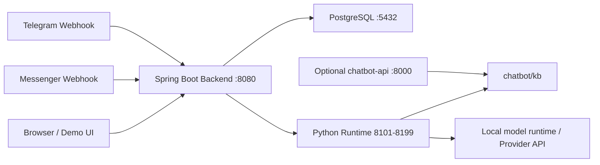

# C.5 Tài liệu triển khai

## 1. Mục đích

Tài liệu này hướng dẫn triển khai hệ thống chatbot tư vấn và gợi ý sản phẩm nội thất sử dụng RAG và mô hình ngôn ngữ lớn thông qua API/runtime cục bộ. Nội dung bao gồm kiến trúc triển khai, yêu cầu môi trường, biến môi trường, cách cài đặt, cách chạy bằng Docker Compose, cách chạy local và các bước kiểm tra sau triển khai.

Tài liệu áp dụng cho môi trường phát triển, demo và triển khai nội bộ của sản phẩm.

## 2. Kiến trúc triển khai

Hệ thống gồm các thành phần triển khai chính:

- Frontend: giao diện HTML/CSS/JavaScript tĩnh được đóng gói trong backend Spring Boot. Các URL chính gồm `/login`, `/admin`, `/tenant`, `/tenant/purchase-requests`, `/chat`, `/chat/general`.
- Backend service: ứng dụng Spring Boot trong thư mục `multitenant/`, cung cấp REST API, phục vụ giao diện static, quản lý tenant, chatbot, conversation, purchase request, Messenger/Telegram binding và điều phối Python runtime.
- AI/RAG service: dịch vụ Python FastAPI trong thư mục `chatbot/`, cung cấp `/healthz`, `/chat`, `/feedback`, `/state`, xử lý retrieval, prompt, state hội thoại và sinh câu trả lời.
- Database: PostgreSQL 16, lưu tenant, user/session metadata, chatbot instance, conversation, message, lead, feedback, purchase request và cấu hình binding kênh.
- Thành phần lưu trữ phục vụ retrieval: thư mục knowledge base trong `chatbot/kb/`, gồm `raw_urls.txt`, `docs.jsonl`, `chunks.jsonl`, `index.json`; hệ thống dùng file-based index thay cho vector database riêng.
- API gọi mô hình ngôn ngữ lớn: cấu hình trong chatbot instance và request Python `GenerationConfig`, gồm provider local hoặc provider API qua `api_model`, `api_key`, `api_base_url`.
- Docker/Docker Compose: `docker-compose.yml` định nghĩa PostgreSQL, backend app và profile chạy Python chatbot API độc lập.

Sơ đồ triển khai:



## 3. Yêu cầu môi trường

Hệ điều hành:

- Windows 10/11, Linux hoặc macOS.
- Với Docker Desktop trên Windows, bật WSL2 backend hoặc Docker engine tương đương.

Runtime:

- Java 21.
- Python 3.11.
- Maven 3.9+ hoặc Maven Wrapper trong `multitenant/`.

Package manager:

- Maven cho backend Java.
- `pip` cho Python dependencies.

Database:

- PostgreSQL 16 khi chạy local.
- Docker Compose dùng image `postgres:16`.

Docker/Docker Compose:

- Docker Desktop hoặc Docker Engine.
- Docker Compose v2.

API key/biến môi trường:

- Cấu hình database.
- Cấu hình Python runtime.
- Cấu hình model/provider.
- Cấu hình token webhook Messenger/Telegram nếu dùng kênh ngoài.
- API key provider mô hình ngôn ngữ lớn nếu chatbot sử dụng provider API.

## 4. Cấu hình biến môi trường

| Tên biến | Ý nghĩa | Ví dụ giá trị giả lập | Bắt buộc/Tùy chọn |
| --- | --- | --- | --- |
| `POSTGRES_DB` | Tên database khi chạy Docker Compose | `global_admin` | Tùy chọn |
| `POSTGRES_USER` | User PostgreSQL | `postgres` | Tùy chọn |
| `POSTGRES_PASSWORD` | Password PostgreSQL | `change-me` | Tùy chọn |
| `POSTGRES_PORT` | Port PostgreSQL publish ra host | `5432` | Tùy chọn |
| `APP_PORT` | Port backend publish ra host | `8080` | Tùy chọn |
| `SPRING_DATASOURCE_URL` | JDBC URL của PostgreSQL | `jdbc:postgresql://localhost:5432/global_admin` | Bắt buộc khi chạy local |
| `SPRING_DATASOURCE_USERNAME` | Username kết nối database | `postgres` | Bắt buộc khi chạy local |
| `SPRING_DATASOURCE_PASSWORD` | Password kết nối database | `change-me` | Bắt buộc khi chạy local |
| `SPRING_DATASOURCE_DRIVER_CLASS_NAME` | JDBC driver class | `org.postgresql.Driver` | Tùy chọn |
| `SERVER_PORT` | Port backend Spring Boot | `8080` | Tùy chọn |
| `PYTHON_BIN` | Python binary để backend spawn AI/RAG service | `python` hoặc `/usr/bin/python3` | Bắt buộc |
| `MODEL_SERVER_DIR` | Thư mục Python chatbot service | `F:/20251/prj3/chatbot` hoặc `/opt/app/chatbot` | Bắt buộc |
| `LLM_HOST` | Host bind cho Python runtime do backend quản lý | `127.0.0.1` | Tùy chọn |
| `LLM_PORT_START` | Port bắt đầu cho runtime theo tenant | `8101` | Tùy chọn |
| `LLM_PORT_END` | Port kết thúc cho runtime theo tenant | `8199` | Tùy chọn |
| `LLM_HEALTH_PATH` | Endpoint health của Python runtime | `/healthz` | Tùy chọn |
| `LLM_UVICORN_MODULE` | Uvicorn module chạy FastAPI | `app.server:app` | Tùy chọn |
| `LLM_CONNECT_TIMEOUT_MS` | Timeout kết nối tới Python runtime | `2000` | Tùy chọn |
| `LLM_RESPONSE_TIMEOUT_MS` | Timeout phản hồi chat | `120000` | Tùy chọn |
| `LLM_STARTUP_TIMEOUT_MS` | Timeout chờ Python runtime sẵn sàng | `600000` | Tùy chọn |
| `BASE_MODEL` | Model local mặc định cho runtime trong backend container | `TinyLlama/TinyLlama-1.1B-Chat-v1.0` | Tùy chọn |
| `KB_DIR` | Thư mục knowledge base khi chạy Python service độc lập | `/app/kb/article` | Bắt buộc cho RAG độc lập |
| `CHATBOT_KB_DIR` | KB dir cho service `chatbot-api` trong Compose profile | `/app/kb/article` | Tùy chọn |
| `CHATBOT_BASE_MODEL` | Model local cho service `chatbot-api` | `TinyLlama/TinyLlama-1.1B-Chat-v1.0` | Tùy chọn |
| `CHATBOT_LORA_ADAPTER` | Đường dẫn adapter nếu runtime local cần adapter | `/app/adapters/example` | Tùy chọn |
| `CHATBOT_TOKENIZER_PATH` | Đường dẫn tokenizer riêng | `/app/adapters/example` | Tùy chọn |
| `CHATBOT_PORT` | Port publish Python chatbot API độc lập | `8000` | Tùy chọn |
| `LORA_ADAPTER` | Adapter path cho Python service độc lập | `/app/adapters/example` | Tùy chọn |
| `TOKENIZER_PATH` | Tokenizer path cho Python service độc lập | `/app/adapters/example` | Tùy chọn |
| `MAX_NEW_TOKENS` | Số token sinh tối đa | `256` | Tùy chọn |
| `TEMPERATURE` | Sampling temperature | `0.7` | Tùy chọn |
| `TOP_P` | Nucleus sampling | `0.9` | Tùy chọn |
| `TOP_K` | Top-k sampling | `50` | Tùy chọn |
| `MESSENGER_VERIFY_TOKEN` | Token verify webhook Messenger | `verify-token-demo` | Tùy chọn |
| `api_key` trong chatbot config | API key gọi provider mô hình ngôn ngữ lớn | `provider-key-placeholder` | Tùy chọn theo provider |
| `api_base_url` trong chatbot config | Base URL provider mô hình ngôn ngữ lớn | `https://provider.example` | Tùy chọn theo provider |
| `api_model` trong chatbot config | Tên model provider | `provider-model` | Tùy chọn theo provider |

Không ghi secret thật vào repository, tài liệu, log hoặc file cấu hình dùng chung.

## 5. Cài đặt và chạy hệ thống

### 5.1. Clone repository

```powershell
git clone <repository-url>
cd prj3
```

### 5.2. Cài đặt dependencies Python

```powershell
cd F:\20251\prj3\chatbot
py -3.11 -m venv .venv
.\.venv\Scripts\Activate.ps1
pip install -r requirements.txt
```

Trên Linux/macOS:

```bash
cd /path/to/prj3/chatbot
python3.11 -m venv .venv
source .venv/bin/activate
pip install -r requirements.txt
```

### 5.3. Cấu hình database local

Tạo database PostgreSQL:

```sql
CREATE DATABASE global_admin;
```

Thiết lập biến môi trường cho backend:

```powershell
$env:SPRING_DATASOURCE_URL="jdbc:postgresql://localhost:5432/global_admin"
$env:SPRING_DATASOURCE_USERNAME="postgres"
$env:SPRING_DATASOURCE_PASSWORD="change-me"
$env:PYTHON_BIN="F:\20251\prj3\chatbot\.venv\Scripts\python.exe"
$env:MODEL_SERVER_DIR="F:\20251\prj3\chatbot"
$env:LLM_HOST="127.0.0.1"
$env:LLM_PORT_START="8101"
$env:LLM_PORT_END="8199"
$env:MESSENGER_VERIFY_TOKEN="verify-token-demo"
```

Flyway tự chạy migration khi backend khởi động.

### 5.4. Chạy backend

```powershell
cd F:\20251\prj3\multitenant
mvn spring-boot:run
```

Hoặc build jar:

```powershell
cd F:\20251\prj3\multitenant
mvn -q -DskipTests package
java -jar target\*.jar
```

Backend phục vụ API và frontend tại:

```text
http://localhost:8080
```

### 5.5. Chạy AI/RAG service độc lập

Backend có thể tự spawn Python runtime theo tenant. Khi cần kiểm tra Python service độc lập:

```powershell
cd F:\20251\prj3\chatbot
.\.venv\Scripts\Activate.ps1
$env:KB_DIR="F:\20251\prj3\chatbot\kb\noithatcaco"
uvicorn app.server:app --host 0.0.0.0 --port 8000
```

Kiểm tra:

```text
http://localhost:8000/healthz
http://localhost:8000/docs
```

### 5.6. Chạy frontend

Frontend là static UI đóng gói trong backend Spring Boot. Sau khi backend chạy, truy cập:

```text
http://localhost:8080/login
http://localhost:8080/admin
http://localhost:8080/tenant
http://localhost:8080/tenant/purchase-requests
http://localhost:8080/chat
http://localhost:8080/chat/general
```

### 5.7. Kiểm tra hệ thống

Kiểm tra backend:

```powershell
curl http://localhost:8080/login
```

Kiểm tra Python service độc lập:

```powershell
curl http://localhost:8000/healthz
```

Kiểm tra chat tenant bằng API:

```powershell
curl -X POST http://localhost:8080/api/chat/start `
  -H "Content-Type: application/json" `
  -H "X-API-Key: tenant-api-key-demo" `
  -d "{\"chatbotId\":\"chatbot-uuid\"}"
```

## 6. Triển khai bằng Docker/Docker Compose

Repository có `docker-compose.yml`, `multitenant/Dockerfile` và `chatbot/Dockerfile`.

### 6.1. Build và start toàn hệ thống

Từ root repository:

```powershell
cd F:\20251\prj3
docker compose up --build
```

Chạy nền:

```powershell
docker compose up --build -d
```

Các service chính:

- `postgres`: PostgreSQL 16.
- `app`: backend Spring Boot, đồng thời chứa Python runtime và thư mục chatbot để backend spawn AI/RAG service theo tenant.
- `chatbot-api`: Python FastAPI service độc lập, chạy khi bật profile `chatbot-api`.

### 6.2. Start Python chatbot API độc lập bằng Compose profile

```powershell
docker compose --profile chatbot-api up --build chatbot-api
```

Endpoint:

```text
http://localhost:8000/healthz
http://localhost:8000/docs
```

### 6.3. Stop service

```powershell
docker compose down
```

Xóa volume database khi cần tạo lại dữ liệu:

```powershell
docker compose down -v
```

### 6.4. Xem logs

Logs backend:

```powershell
docker compose logs --no-color --tail=200 app
```

Logs PostgreSQL:

```powershell
docker compose logs --no-color --tail=100 postgres
```

Logs Python chatbot API độc lập:

```powershell
docker compose logs --no-color --tail=200 chatbot-api
```

### 6.5. Build image thủ công

Backend:

```powershell
docker build -f multitenant/Dockerfile -t furniture-chatbot-app .
```

Python chatbot API:

```powershell
docker build -f chatbot/Dockerfile -t furniture-chatbot-api .
```

### 6.6. Volume và dữ liệu runtime

Docker Compose mount các thư mục:

- `./chatbot/kb:/opt/app/chatbot/kb`
- `./chatbot/adapters:/opt/app/chatbot/adapters`
- `./chatbot/out:/opt/app/chatbot/out`
- `./chatbot/logs:/opt/app/chatbot/logs`
- `huggingface-cache:/root/.cache/huggingface`
- `postgres-data:/var/lib/postgresql/data`

Các mount này giúp giữ knowledge base, logs, output và cache model qua nhiều lần restart container.

## 7. Kiểm tra sau triển khai

### 7.1. Health check

Backend/UI:

```powershell
curl http://localhost:8080/login
```

Python service độc lập:

```powershell
curl http://localhost:8000/healthz
```

Runtime do backend quản lý:

```powershell
curl http://localhost:8080/api/runtime/llm
```

Endpoint `/api/runtime/llm` yêu cầu session platform admin.

### 7.2. Kiểm tra API

Đăng nhập admin:

```powershell
curl -X POST http://localhost:8080/api/login/admin `
  -H "Content-Type: application/json" `
  -d "{\"name\":\"admin\",\"code\":\"admin-password-demo\"}"
```

Tạo conversation tenant:

```powershell
curl -X POST http://localhost:8080/api/chat/start `
  -H "Content-Type: application/json" `
  -H "X-API-Key: tenant-api-key-demo" `
  -d "{\"chatbotId\":\"chatbot-uuid\"}"
```

Gửi tin nhắn:

```powershell
curl -X POST http://localhost:8080/api/chat/send `
  -H "Content-Type: application/json" `
  -H "X-API-Key: tenant-api-key-demo" `
  -d "{\"conversationId\":\"conversation-uuid\",\"message\":\"Tôi muốn mua sofa cho phòng khách nhỏ\"}"
```

### 7.3. Kiểm tra giao diện

Mở trình duyệt:

- `http://localhost:8080/login`
- `http://localhost:8080/admin`
- `http://localhost:8080/tenant`
- `http://localhost:8080/tenant/purchase-requests`
- `http://localhost:8080/chat`
- `http://localhost:8080/chat/general`

Các kiểm tra chính:

- Trang tải đúng static assets.
- Login tạo session.
- Admin/Tenant UI gọi API thành công.
- Chat UI tạo conversation và gửi message.
- Purchase request UI hiển thị yêu cầu mua hàng.

### 7.4. Kiểm tra luồng hỏi đáp/gợi ý sản phẩm

Kịch bản kiểm tra:

```text
Tôi muốn mua sofa cho phòng khách nhỏ, ngân sách khoảng 10 triệu.
Tôi thích phong cách hiện đại, màu trung tính.
Tên tôi là Nguyễn Văn A, số điện thoại là 0912345678.
Địa chỉ nhận hàng là 123 Nguyễn Trãi, Hà Nội.
CONFIRM
```

Kết quả kiểm tra:

- Chatbot trả lời theo nhu cầu sản phẩm nội thất.
- Backend lưu conversation và messages.
- Python runtime truy xuất knowledge base theo tenant.
- Hệ thống tạo purchase request khi hội thoại có xác nhận và thông tin cần thiết.
- `/api/purchase-requests` trả dữ liệu yêu cầu mua hàng theo tenant.

## 8. Lỗi thường gặp và cách xử lý

| Lỗi | Nguyên nhân | Cách xử lý |
| --- | --- | --- |
| Backend không kết nối được PostgreSQL | Sai `SPRING_DATASOURCE_URL`, username/password hoặc database không chạy | Kiểm tra PostgreSQL, biến môi trường database và port `5432`; với Docker dùng `docker compose ps` và `docker compose logs postgres` |
| Flyway migration lỗi | Schema database không khớp migration hoặc database dùng lại dữ liệu cũ không phù hợp | Kiểm tra log backend; trong môi trường demo có thể tạo database mới hoặc dùng `docker compose down -v` để reset volume |
| Backend trả `401 Unauthorized` | Thiếu session hoặc API yêu cầu đăng nhập | Gọi API login trước hoặc dùng đúng cookie session trong client |
| Backend trả `403 Forbidden` | Role không đủ quyền hoặc tenant scope không khớp | Kiểm tra role `PLATFORM_ADMIN`, `TENANT_ADMIN`, `TENANT_MEMBER`; kiểm tra tenant id trong session/header |
| Backend trả `Missing tenant header (X-API-Key or X-Tenant-Id)` | API tenant-scoped không có tenant context | Gửi header `X-API-Key` hoặc `X-Tenant-Id`, hoặc đăng nhập tenant để có session tenant |
| Backend trả `Invalid API key` | API key tenant không tồn tại hoặc sai | Kiểm tra tenant `api_key` trong database/demo seed; không dùng key thật trong tài liệu public |
| Python runtime không ready | Model trong quá trình nạp, model tải chậm hoặc timeout startup thấp | Tăng `LLM_STARTUP_TIMEOUT_MS`; kiểm tra logs `app`; kiểm tra `BASE_MODEL` và cache model |
| `/healthz` trả `kb_loaded=false` | `KB_DIR` không trỏ tới thư mục có `chunks.jsonl` và `index.json` | Kiểm tra `KB_DIR`, `tenant.kb_dir`, mount volume `chatbot/kb` và file KB |
| Chat trả fallback do upstream lỗi | Python runtime lỗi, timeout hoặc process exit | Xem `docker compose logs app`; kiểm tra `PYTHON_BIN`, `MODEL_SERVER_DIR`, dependencies Python và port range `8101-8199` |
| Không build được Docker image backend | Maven build lỗi hoặc dependency download lỗi | Kiểm tra network, Maven cache, `multitenant/pom.xml`; chạy `mvn -q -DskipTests package` local để xem lỗi chi tiết |
| Không cài được Python dependencies | Phiên bản Python không đúng hoặc lỗi tải package | Dùng Python 3.11; với Docker kiểm tra `requirements-docker.txt`; với local dùng `requirements.txt` |
| Rebuild KB lỗi | `raw_urls.txt` rỗng/sai, Python tooling không chạy hoặc `MODEL_SERVER_DIR` sai | Kiểm tra tenant `kb_dir`, file `raw_urls.txt`, log rebuild và quyền ghi thư mục KB |
| Messenger verify webhook lỗi | `hub.verify_token` không khớp `MESSENGER_VERIFY_TOKEN` | Kiểm tra biến `MESSENGER_VERIFY_TOKEN` và cấu hình webhook bên Messenger |
| Telegram webhook không xử lý update | Sai `secretPath` hoặc binding không active | Kiểm tra API `/api/telegram/bindings`, `secretPath`, `status` và logs backend |
| UI không tải hoặc route trả 404 | Backend không hoạt động hoặc truy cập sai URL | Mở `http://localhost:8080/login`; kiểm tra `AdminUiController` routes và logs backend |
| Purchase request không xuất hiện | Hội thoại không có đủ thông tin hoặc tenant/session không đúng | Kiểm tra transcript, thông tin tên/số điện thoại/địa chỉ, API `/api/purchase-requests` và tenant context |
