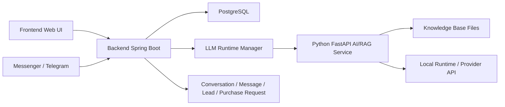

# R.4 Tổng quan kỹ thuật hệ thống

## 1. Mục đích tài liệu

Tài liệu này mô tả tổng quan kỹ thuật của hệ thống chatbot tư vấn và gợi ý sản phẩm nội thất sử dụng RAG và tích hợp mô hình ngôn ngữ lớn qua API/runtime cục bộ. Nội dung tập trung vào kiến trúc hệ thống, cấu trúc thư mục, các module chức năng, luồng xử lý chính, thiết kế dữ liệu, thiết kế API, kiểm thử và triển khai.

Tài liệu phục vụ cho việc đọc hiểu mã nguồn, vận hành hệ thống, bảo trì module và đối chiếu với các tài liệu sản phẩm khác:

- C.3 Dữ liệu, test cases và kết quả thử nghiệm: `docs/C3_TEST_CASES_AND_RESULTS.md`
- C.4 API documentation: `docs/API_DOCUMENTATION.md`
- C.5 Tài liệu triển khai: `docs/DEPLOYMENT_GUIDE.md`

## 2. Kiến trúc hệ thống

Hệ thống được tổ chức theo mô hình nhiều thành phần, trong đó backend Spring Boot điều phối nghiệp vụ và Python FastAPI service xử lý AI/RAG.



Các thành phần chính:

- Frontend: giao diện HTML/CSS/JavaScript tĩnh trong `multitenant/src/main/resources/static`, phục vụ login, admin, tenant, purchase request, web chat và general chat.
- Backend: ứng dụng Spring Boot trong `multitenant/`, cung cấp API nghiệp vụ, bảo mật session, tenant context, quản lý chatbot, hội thoại, purchase request, KB operations và webhook kênh ngoài.
- AI/RAG service: dịch vụ FastAPI trong `chatbot/`, cung cấp `/healthz`, `/chat`, `/feedback`, `/state`, thực hiện retrieval, xây prompt, quản lý state hội thoại và sinh câu trả lời.
- Database: PostgreSQL, quản lý schema bằng Flyway migrations trong `multitenant/src/main/resources/db/migration`.
- Thành phần xử lý dữ liệu sản phẩm: scripts trong `chatbot/tools/`, gồm crawl dữ liệu nguồn và build knowledge base.
- Thành phần retrieval/knowledge base: thư mục `chatbot/kb/`, module `retriever.py`, `retrieval_service.py` và package `retrievers/`.
- Thành phần tích hợp mô hình ngôn ngữ lớn qua API: cấu hình provider trong `chatbot_instances`, `PythonChatClient` ở backend và logic provider trong `chatbot/app/server.py`.
- Thành phần lưu lịch sử hội thoại: bảng `conversations`, `messages`, `leads`, `purchase_requests`, kết hợp state trong Python theo `conversation_id`.

## 3. Kiến trúc thư mục

```text
.
├── README.md
├── docker-compose.yml
├── docs/
├── diagram/
├── chatbot/
│   ├── app/
│   │   ├── server.py
│   │   ├── model_loader.py
│   │   ├── retriever.py
│   │   ├── retrieval_service.py
│   │   ├── retrievers/
│   │   ├── prompt.py
│   │   ├── prompt_builder.py
│   │   ├── sales_flow.py
│   │   ├── consultation.py
│   │   ├── state.py
│   │   ├── guardrails.py
│   │   └── logger.py
│   ├── kb/
│   ├── tools/
│   ├── eval/
│   ├── tests/
│   ├── requirements.txt
│   ├── requirements-docker.txt
│   └── Dockerfile
├── multitenant/
│   ├── src/main/java/com/app/
│   │   ├── admin/
│   │   ├── adminui/
│   │   ├── auth/
│   │   ├── bots/
│   │   ├── chat/
│   │   ├── config/
│   │   ├── kb/
│   │   ├── leads/
│   │   ├── messenger/
│   │   ├── modelserver/
│   │   ├── ops/
│   │   ├── purchases/
│   │   ├── telegram/
│   │   ├── tenant/
│   │   └── tenants/
│   ├── src/main/resources/
│   │   ├── application.yml
│   │   ├── db/migration/
│   │   └── static/
│   ├── src/test/
│   ├── pom.xml
│   └── Dockerfile
└── references/
```

Vai trò từng thư mục:

- `docs/`: tài liệu project, API, kiểm thử, triển khai và tổng quan kỹ thuật.
- `diagram/`: hình ảnh sơ đồ kiến trúc, ERD, class/sequence diagram.
- `chatbot/app/`: mã nguồn Python AI/RAG service.
- `chatbot/kb/`: dữ liệu sản phẩm và knowledge base theo tenant.
- `chatbot/tools/`: công cụ crawl, build KB, chạy script hội thoại và regression.
- `chatbot/eval/`: bộ câu hỏi đánh giá retrieval, metrics và kết quả thử nghiệm.
- `chatbot/tests/`: test Python cho retrieval, prompt, guardrail và sales flow.
- `multitenant/src/main/java/com/app/`: backend Spring Boot theo package chức năng.
- `multitenant/src/main/resources/db/migration/`: Flyway migrations.
- `multitenant/src/main/resources/static/`: frontend static UI.
- `multitenant/src/test/`: test backend Spring Boot.

## 4. Các module chức năng

| Module | Vai trò | Đầu vào | Xử lý chính | Đầu ra |
| --- | --- | --- | --- | --- |
| Product management | Quản lý tenant, chatbot và nguồn dữ liệu sản phẩm | Tenant config, chatbot config, URL nguồn, `kbDir` | Lưu tenant/chatbot, validate URL, quản lý source URL theo tenant | Tenant, chatbot instance, danh sách URL nguồn |
| Data processing/import | Xử lý dữ liệu sản phẩm thành KB | `raw_urls.txt`, URL sản phẩm/chính sách | Crawl nội dung, chuẩn hóa dữ liệu, chia chunk, tạo index | `docs.jsonl`, `chunks.jsonl`, `index.json` |
| Retrieval/knowledge base | Truy xuất tri thức phục vụ RAG | Câu hỏi người dùng, KB dir, chunks/index | Tìm context liên quan bằng keyword/vector/hybrid/rerank | Danh sách đoạn tri thức liên quan |
| Chatbot/question answering | Hỏi đáp thông tin sản phẩm | Message, history, chatbot config, retrieval context | Xây prompt, gọi model/provider, áp guardrail, lưu state | Reply chatbot, metadata model/latency |
| Recommendation/advising | Tư vấn/gợi ý theo nhu cầu | Loại sản phẩm, ngân sách, phòng, phong cách, chất liệu | Trích xuất slot, cập nhật stage, gợi ý lựa chọn phù hợp | Câu trả lời tư vấn, câu hỏi tiếp theo, trigger mua hàng |
| Comparison/reference | Tham chiếu thông tin sản phẩm và giá | Câu hỏi về khoảng giá/sản phẩm tương tự/chính sách | Tra cứu `price_reference.json`, tìm item tương tự, benchmark retrieval | Nhận xét tham chiếu giá, sản phẩm liên quan, kết quả Recall@k/MRR |
| API layer | Cung cấp API cho UI/kênh ngoài | HTTP request, session, tenant header | Validate request, phân quyền, gọi service, serialize response | JSON response, lỗi HTTP chuẩn |
| Frontend UI | Giao diện sử dụng và quản trị | Người dùng thao tác trên browser | Gọi backend API, hiển thị chat, admin, tenant, purchase request | UI phản hồi, dữ liệu hiển thị |
| Deployment/configuration | Đóng gói và vận hành hệ thống | Docker Compose, Dockerfile, env vars | Build image, chạy PostgreSQL/backend/Python runtime, mount KB/logs | Hệ thống chạy trên local/demo/server |

## 5. Luồng xử lý chính

### 5.1. Luồng quản lý dữ liệu sản phẩm

1. Tenant/admin cấu hình tenant và `kbDir`.
2. Tenant/admin quản lý danh sách URL nguồn qua `/api/kb/source-urls`.
3. URL được ghi vào `raw_urls.txt` trong thư mục KB của tenant.
4. Backend lưu thông tin tenant và chatbot trong PostgreSQL.

### 5.2. Luồng xử lý dữ liệu phục vụ truy xuất

1. Backend nhận yêu cầu rebuild KB qua `/api/kb/rebuild`.
2. `TenantKbRebuildService` xác định `kbDir`, `raw_urls.txt`, `docs.jsonl`, `chunks.jsonl`, `index.json`.
3. Backend chạy `chatbot/tools/scrape_site.py` để thu thập dữ liệu sản phẩm/chính sách.
4. Backend chạy `chatbot/tools/build_kb.py` để chia chunk và tạo index.
5. Backend evict runtime tenant để phiên chat kế tiếp nạp knowledge base mới.

### 5.3. Luồng người dùng hỏi chatbot

1. Client tạo conversation bằng `/api/chat/start` hoặc `/api/general/chat/start`.
2. Client gửi message bằng `/api/chat/send` hoặc `/api/general/chat/send`.
3. Backend lưu user message vào bảng `messages`.
4. Backend lấy history, chatbot config và tenant context.
5. `LlmInstanceManager` khởi tạo hoặc tái sử dụng Python runtime.
6. Backend gọi Python `/chat` thông qua `PythonChatClient`.
7. Backend lưu assistant message và trả response về client.

### 5.4. Luồng gợi ý sản phẩm

1. Python service nhận message và `conversation_id`.
2. `sales_flow.py` hoặc `consultation.py` trích xuất slot như loại sản phẩm, ngân sách, không gian, phong cách, chất liệu.
3. State hội thoại được cập nhật theo stage tư vấn.
4. Retrieval lấy context liên quan từ KB.
5. Prompt kết hợp system prompt, history, state và context.
6. Model sinh câu trả lời tư vấn/gợi ý và câu hỏi tiếp theo.

### 5.5. Luồng gọi mô hình ngôn ngữ lớn qua API

1. Backend gửi `GenerationConfig` gồm `base_model`, `provider`, `api_model`, `api_key`, `api_base_url`, `temperature`, `top_p`, `top_k`.
2. Python service chọn provider:
   - `local`: dùng pipeline trong `model_loader.py`.
   - `claude`: gọi provider API qua HTTP request.
3. Python service xử lý output, áp dụng guardrail và trả `ChatResp`.
4. Backend map response thành `reply`, `latencyMs`, `model`, `adapter`, `llmBaseUrl`.

### 5.6. Luồng trả kết quả về giao diện

1. Frontend gửi request chat tới backend.
2. Backend trả JSON response.
3. Frontend hiển thị user message, typing/loading state và assistant reply.
4. Sidebar conversation cập nhật title, message count và preview.
5. Nếu có purchase request, tenant UI lấy dữ liệu từ `/api/purchase-requests`.

## 6. Thiết kế API

Các nhóm API chính:

- System / Health check: `/healthz`, `/api/runtime/llm`, `/api/ops/*`.
- Authentication / User: `/api/login/*`, `/api/me`, `/api/admin/tenants`, `/api/tenant-members`.
- Product management: `/api/chatbots`.
- Data import / processing: `/api/kb/source-urls`, `/api/kb/rebuild`.
- Knowledge base / Retrieval: rebuild KB, benchmark summary.
- Chatbot / Conversation: `/api/chat/*`, `/api/general/chat/*`, Python `/chat`, `/state`, `/feedback`.
- Product recommendation / advising: general chat và tenant sales chat.
- Purchase request / handoff: `/api/purchase-requests/*`, lead APIs.
- Messenger/Telegram integration: `/api/messenger/bindings`, `/webhook/messenger`, `/api/telegram/bindings`, `/webhook/telegram/{secretPath}`.

Chi tiết endpoint, request/response schema, authentication và status codes được trình bày trong:

- `docs/API_DOCUMENTATION.md`

## 7. Thiết kế dữ liệu

### 7.1. Dữ liệu sản phẩm

Dữ liệu sản phẩm được lưu theo tenant trong thư mục KB:

- `raw_urls.txt`: URL nguồn.
- `docs.jsonl`: tài liệu sản phẩm/chính sách sau thu thập.
- `chunks.jsonl`: đoạn tri thức phục vụ retrieval.
- `index.json`: chỉ mục tìm kiếm.
- `price_reference.json`: dữ liệu tham chiếu giá theo nhóm sản phẩm.

### 7.2. Dữ liệu tenant và chatbot

Các bảng chính:

- `tenants`: thông tin tenant, API key, `kb_dir`.
- `tenant_members`: thành viên tenant và role.
- `chatbot_instances`: cấu hình chatbot, channel, persona, response style, provider, model config.

### 7.3. Dữ liệu người dùng/hội thoại

Các bảng chính:

- `conversations`: conversation theo tenant/chatbot/user external id.
- `messages`: user/assistant/system messages.
- `leads`: snapshot khách hàng và transcript sau handoff.
- `purchase_requests`: yêu cầu mua hàng từ hội thoại.
- `feedback`: phản hồi đánh giá câu trả lời.

Python service cũng lưu state hội thoại theo `conversation_id`, gồm stage, slots, last question và last answer.

### 7.4. Dữ liệu đầu vào

- Câu hỏi/yêu cầu của người dùng.
- URL nguồn sản phẩm/chính sách.
- Chatbot config và provider config.
- Tenant API key hoặc session principal.
- Request webhook Messenger/Telegram.

### 7.5. Dữ liệu đầu ra

- Reply chatbot.
- Kết quả retrieval nội bộ dùng làm context.
- Conversation/message history.
- Purchase request và lead.
- Runtime/ops snapshot.
- Kết quả benchmark retrieval.

### 7.6. Kết quả thử nghiệm

Kết quả thử nghiệm retrieval nằm trong `chatbot/eval/results-summary.md`, gồm Recall@5 và MRR cho các mode:

- `keyword`
- `vector`
- `hybrid`
- `hybrid_rerank`

Tài liệu dữ liệu, test cases và kết quả thử nghiệm nằm tại:

- `docs/C3_TEST_CASES_AND_RESULTS.md`

## 8. Kiểm thử

Các nhóm kiểm thử chính:

- Khởi động hệ thống và health check.
- Quản lý dữ liệu sản phẩm.
- Xử lý/import dữ liệu sản phẩm.
- Retrieval và benchmark RAG.
- Chatbot hỏi đáp sản phẩm.
- Gợi ý/tư vấn sản phẩm.
- Tham chiếu giá và sản phẩm liên quan.
- Kiểm tra lỗi đầu vào.
- Kiểm tra giao diện demo.
- Kiểm tra tích hợp frontend - backend - AI/RAG service.

Vị trí test trong repo:

- Backend tests: `multitenant/src/test/java/com/app`
- Python tests: `chatbot/tests`
- Retrieval evaluation: `chatbot/eval`
- Vietnamese buyer script: `chatbot/tools/datasets/vietnamese_buyer_script.json`

Chi tiết test cases, dữ liệu đầu vào/đầu ra và kết quả thử nghiệm được trình bày trong:

- `docs/C3_TEST_CASES_AND_RESULTS.md`

## 9. Triển khai

Hệ thống hỗ trợ hai cách triển khai:

- Docker Compose: chạy PostgreSQL và backend app; backend container chứa Python runtime để spawn AI/RAG service theo tenant; profile `chatbot-api` chạy Python API độc lập khi cần.
- Local/manual: chạy PostgreSQL local, backend bằng Maven/Java 21, Python service bằng virtual environment Python 3.11.

Các file triển khai chính:

- `docker-compose.yml`
- `multitenant/Dockerfile`
- `chatbot/Dockerfile`
- `multitenant/src/main/resources/application.yml`
- `chatbot/requirements.txt`
- `chatbot/requirements-docker.txt`

Các biến môi trường chính:

- `SPRING_DATASOURCE_URL`
- `SPRING_DATASOURCE_USERNAME`
- `SPRING_DATASOURCE_PASSWORD`
- `PYTHON_BIN`
- `MODEL_SERVER_DIR`
- `LLM_HOST`
- `LLM_PORT_START`
- `LLM_PORT_END`
- `KB_DIR`
- `BASE_MODEL`
- `MESSENGER_VERIFY_TOKEN`

Chi tiết cài đặt, Docker Compose, kiểm tra sau triển khai và lỗi thường gặp được trình bày trong:

- `docs/DEPLOYMENT_GUIDE.md`
