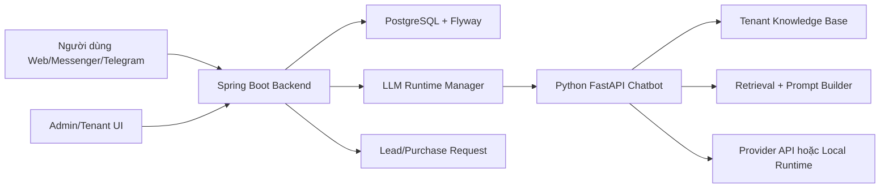

# Tài liệu đặc tả sản phẩm - Hệ thống chatbot tư vấn nội thất dùng RAG và API mô hình ngôn ngữ lớn

## 1. Mục tiêu sản phẩm

Hệ thống chatbot tư vấn nội thất hỗ trợ người dùng hỏi đáp thông tin sản phẩm, nhận gợi ý theo nhu cầu và tạo yêu cầu mua hàng cho cửa hàng. Giải pháp sử dụng RAG để truy xuất tri thức từ dữ liệu sản phẩm/chính sách của từng cửa hàng, sau đó tích hợp mô hình ngôn ngữ lớn thông qua API hoặc runtime cục bộ để sinh câu trả lời theo ngữ cảnh hội thoại.

Sản phẩm được thiết kế theo mô hình multi-tenant. Mỗi cửa hàng có tenant, chatbot, knowledge base, cấu hình mô hình và kênh giao tiếp riêng. Backend dùng chung cung cấp API quản trị, API chat, quản lý hội thoại, quản lý yêu cầu mua hàng và điều phối dịch vụ chatbot Python.

## 2. Phạm vi chức năng

Các nhóm chức năng chính của sản phẩm:

- Quản lý tenant/cửa hàng và thành viên quản trị.
- Quản lý chatbot theo tenant, gồm persona, kênh, mode, provider và cấu hình sinh câu trả lời.
- Quản lý nguồn dữ liệu sản phẩm phục vụ knowledge base.
- Xử lý dữ liệu sản phẩm thành tài liệu, chunk và chỉ mục truy xuất.
- Truy xuất tri thức bằng RAG trên knowledge base của từng tenant.
- Tích hợp mô hình ngôn ngữ lớn qua cấu hình provider API hoặc runtime local.
- Chatbot hỏi đáp thông tin sản phẩm/chính sách dựa trên dữ liệu truy xuất.
- Tư vấn và gợi ý sản phẩm theo nhu cầu, ngân sách, phong cách, không gian, chất liệu và loại sản phẩm.
- Chat tư vấn chung về lựa chọn nội thất qua system tenant.
- Lưu hội thoại, xem lại lịch sử, đổi tên và xóa hội thoại.
- Tạo và quản lý yêu cầu mua hàng từ hội thoại.
- Giao diện web cho admin, tenant admin, web chat và general chat.
- Tích hợp webhook Facebook Messenger và Telegram.
- API vận hành để xem runtime chatbot, thống kê nền tảng, thống kê tenant và kết quả thử nghiệm retrieval.

## 3. Kiến trúc tổng thể



Vai trò các khối:

- `multitenant/`: backend Spring Boot, API nghiệp vụ, quản lý tenant, quản lý chatbot, hội thoại, yêu cầu mua hàng, kênh tích hợp và giao diện static.
- `chatbot/`: dịch vụ FastAPI xử lý hội thoại, RAG, prompt, state hội thoại, rule guardrail và sinh câu trả lời.
- PostgreSQL: lưu tenant, thành viên, chatbot instance, conversation, message, lead, feedback, purchase request và cấu hình binding kênh.
- Knowledge base: lưu dữ liệu sản phẩm sau xử lý theo tenant trong các file `docs.jsonl`, `chunks.jsonl`, `index.json`.

## 4. Quản lý dữ liệu sản phẩm nội thất

Dữ liệu sản phẩm được tổ chức theo từng tenant trong thư mục knowledge base. Mỗi bộ dữ liệu có các thành phần:

- `raw_urls.txt`: danh sách URL nguồn để thu thập dữ liệu.
- `docs.jsonl`: dữ liệu đầu vào được chuẩn hóa từ nguồn crawl hoặc tài liệu sản phẩm.
- `chunks.jsonl`: các đoạn văn bản phục vụ truy xuất tri thức.
- `index.json`: chỉ mục tìm kiếm phục vụ retrieval.

Các thư mục dữ liệu mẫu trong repository:

- `chatbot/kb/noithatcaco`
- `chatbot/kb/article`
- `chatbot/kb/castlery`

Backend lưu đường dẫn knowledge base của tenant trong trường `kb_dir`. Khi một tenant sử dụng chatbot, backend truyền đường dẫn này cho Python runtime thông qua biến môi trường `KB_DIR`.

## 5. Xử lý dữ liệu phục vụ truy xuất tri thức

Quy trình xử lý dữ liệu:

1. Thu thập URL nguồn từ `raw_urls.txt`.
2. Crawl nội dung sản phẩm/chính sách bằng `chatbot/tools/scrape_site.py`.
3. Lưu dữ liệu chuẩn hóa vào `docs.jsonl`.
4. Chia tài liệu thành các chunk bằng `chatbot/tools/build_kb.py`.
5. Tạo chỉ mục `index.json` phục vụ truy xuất.
6. Nạp knowledge base vào Python chatbot service theo `KB_DIR`.

Lệnh mẫu:

```powershell
cd F:\20251\prj3\chatbot
python tools\scrape_site.py article kb\article\raw_urls.txt kb\article\docs.jsonl
python tools\build_kb.py kb\article\docs.jsonl kb\article\chunks.jsonl kb\article\index.json
```

## 6. Hệ thống RAG và retrieval

Python chatbot service sử dụng `SimpleKb` để đọc `chunks.jsonl` và `index.json`. Khi người dùng gửi câu hỏi, hệ thống chọn các đoạn tri thức liên quan, đưa vào prompt cùng lịch sử hội thoại và cấu hình chatbot.

Các thành phần retrieval:

- `chatbot/app/retriever.py`: truy xuất knowledge base dạng đơn giản.
- `chatbot/app/retrieval_service.py`: chuẩn hóa mode retrieval, load KB, format context và ghi debug retrieval.
- `chatbot/app/retrievers/baseline.py`: truy xuất theo từ khóa và heuristic.
- `chatbot/app/retrievers/vector.py`: truy xuất vector.
- `chatbot/app/retrievers/hybrid.py`: kết hợp baseline và vector.
- `chatbot/app/retrievers/hybrid_rerank.py`: rerank kết quả từ hybrid retriever.
- `chatbot/eval/runner.py`: chạy thử nghiệm retrieval trên tập test cases.

Dữ liệu đầu ra của bước retrieval được dùng làm context cho mô hình sinh câu trả lời. Thiết kế này giúp chatbot ưu tiên thông tin trong dữ liệu sản phẩm thay vì trả lời chung chung.

## 7. Tích hợp mô hình ngôn ngữ lớn qua API

Backend lưu cấu hình sinh câu trả lời trong `chatbot_instances`, gồm:

- `base_model`
- `adapter_path`
- `tokenizer_path`
- `system_prompt`
- `max_new_tokens`
- `temperature`
- `top_p`
- `top_k`
- `response_style`
- `mode`
- `provider`
- `api_model`
- `api_key`
- `api_base_url`

Spring Boot gọi Python service qua `PythonChatClient`. Python service nhận `GenerationConfig` trong request `/chat`, sau đó chọn provider theo cấu hình:

- `local`: sử dụng pipeline trong `model_loader.py`.
- `claude`: gọi provider API theo `api_key`, `api_model`, `api_base_url`.

Luồng tích hợp:

1. Backend lấy cấu hình chatbot từ database.
2. `LlmInstanceManager` khởi tạo hoặc tái sử dụng Python runtime theo tenant.
3. Backend gửi request đến Python `/chat`.
4. Python xây prompt từ message, history, context RAG và system prompt.
5. Python sinh reply và trả về backend.
6. Backend lưu message và trả response cho client.

## 8. Chatbot hỏi đáp và tư vấn sản phẩm

Chatbot hỗ trợ hai mode nghiệp vụ:

- `tenant_sales`: tư vấn bán hàng theo dữ liệu của tenant/cửa hàng.
- `general_consumer`: tư vấn nội thất tổng quát qua system tenant.

Trong mode `tenant_sales`, module `sales_flow.py` nhận diện nhu cầu người dùng và cập nhật stage tư vấn. Các thông tin được trích xuất gồm loại sản phẩm, ngân sách, không gian, chất liệu, màu sắc và phong cách. Khi hội thoại đi đến bước chốt nhu cầu, backend tạo lead và purchase request từ transcript/state.

Trong mode `general_consumer`, module `consultation.py` hỗ trợ tư vấn chọn sản phẩm theo nhu cầu sử dụng, diện tích phòng, ngân sách và ưu tiên thiết kế.

Các module hỗ trợ:

- `prompt.py`, `prompt_builder.py`: xây prompt và quy tắc grounding.
- `guardrails.py`: xử lý một số phản hồi theo rule, giới hạn các thông tin nhạy cảm như thanh toán, hoàn tiền, thời gian giao hàng khi thiếu dữ liệu xác thực.
- `state.py`: lưu stage, slots, câu hỏi và câu trả lời gần nhất theo `conversation_id`.
- `logger.py`: ghi log chat và feedback.

## 9. So sánh và tham chiếu thông tin sản phẩm

Sản phẩm hỗ trợ tham chiếu thông tin trong các tình huống:

- Tìm sản phẩm liên quan hoặc tương tự từ knowledge base.
- Tư vấn lựa chọn theo ngân sách, chất liệu, kích thước, không gian và phong cách.
- Tham chiếu khoảng giá từ `chatbot/kb/price_reference.json` cho một số nhóm sản phẩm.
- Chạy thử nghiệm retrieval để so sánh hiệu quả các mode keyword, vector, hybrid và hybrid rerank.

Các kết quả thử nghiệm retrieval được tổng hợp bằng `chatbot/eval/runner.py` và ghi ra file kết quả trong `chatbot/eval/`.

## 10. Backend API

Nhóm chat theo tenant:

- `POST /api/chat/start`
- `POST /api/chat/send`
- `GET /api/chat/conversations`
- `GET /api/chat/conversation/{conversationId}/messages`
- `PUT /api/chat/conversation/{conversationId}/rename`
- `DELETE /api/chat/conversation/{conversationId}`

Nhóm chat tư vấn chung:

- `POST /api/general/chat/start`
- `POST /api/general/chat/send`
- `GET /api/general/chat/conversations`
- `GET /api/general/chat/conversation/{conversationId}/messages`
- `PUT /api/general/chat/conversation/{conversationId}/rename`
- `DELETE /api/general/chat/conversation/{conversationId}`

Nhóm quản trị:

- `POST /api/login/admin`
- `POST /api/login/tenant`
- `POST /api/login/logout`
- `GET /api/me`
- `GET /api/admin/tenants`
- `POST /api/admin/tenants`
- `GET /api/admin/tenants/{tenantId}`
- `GET /api/admin/tenant-members`
- `POST /api/admin/tenant-members`
- `GET /api/tenant-members`
- `POST /api/tenant-members`

Nhóm chatbot và knowledge base:

- `GET /api/chatbots`
- `POST /api/chatbots`
- `PUT /api/chatbots/{id}`
- `GET /api/kb/source-urls`
- `POST /api/kb/source-urls`
- `DELETE /api/kb/source-urls`
- `POST /api/kb/rebuild`

Nhóm purchase request:

- `GET /api/purchase-requests`
- `PUT /api/purchase-requests/{id}/status`
- `PUT /api/purchase-requests/{id}/claim`
- `PUT /api/purchase-requests/{id}/assign`

Nhóm kênh ngoài và vận hành:

- `GET /api/messenger/bindings`
- `POST /api/messenger/bindings`
- `DELETE /api/messenger/bindings/{id}`
- `GET /webhook/messenger`
- `POST /webhook/messenger`
- `GET /api/telegram/bindings`
- `POST /api/telegram/bindings`
- `POST /webhook/telegram/{secretPath}`
- `GET /api/runtime/llm`
- `GET /api/ops/platform`
- `GET /api/ops/tenant`
- `GET /api/ops/benchmark-summary`
- `POST /api/ops/runtime/evict`

## 11. Python chatbot API

`GET /healthz`

Trả trạng thái runtime, thông tin cache pipeline và knowledge base.

`POST /chat`

Request:

```json
{
  "message": "Tôi muốn mua sofa cho phòng khách nhỏ",
  "history": [],
  "gen": {
    "base_model": "Qwen/Qwen2.5-1.5B-Instruct",
    "system_prompt": "You are a helpful furniture sales assistant.",
    "max_new_tokens": 256,
    "temperature": 0.7,
    "top_p": 0.9,
    "top_k": 50,
    "provider": "local",
    "mode": "tenant_sales"
  },
  "conversation_id": "conversation-id",
  "channel": "web",
  "tenant_id": "tenant-id"
}
```

Response:

```json
{
  "reply": "Nội dung tư vấn cho người dùng",
  "latency_ms": 842,
  "model": "Qwen/Qwen2.5-1.5B-Instruct",
  "adapter": null,
  "trigger_purchase_request": false,
  "captured_phone": null,
  "captured_name": null
}
```

`POST /feedback`

Ghi nhận phản hồi đánh giá câu trả lời.

`GET /state?conversation_id=<id>`

Trả stage, slots và câu hỏi/câu trả lời gần nhất của hội thoại.

## 12. Giao diện người dùng và quản trị

Các giao diện web được phục vụ từ `multitenant/src/main/resources/static`:

- `/login`: đăng nhập admin hoặc tenant.
- `/admin`: quản trị nền tảng, tenant, chatbot và thống kê.
- `/tenant`: giao diện tenant admin.
- `/tenant/purchase-requests`: quản lý yêu cầu mua hàng.
- `/chat`: web chat theo tenant.
- `/chat/general`: web chat tư vấn chung.

Giao diện sử dụng HTML/CSS/JavaScript tĩnh và gọi trực tiếp các API backend.

## 13. Dữ liệu đầu vào và đầu ra

Dữ liệu đầu vào:

- URL nguồn sản phẩm/chính sách trong `raw_urls.txt`.
- Nội dung sản phẩm sau crawl trong `docs.jsonl`.
- Câu hỏi người dùng từ web chat, Messenger hoặc Telegram.
- Cấu hình chatbot trong bảng `chatbot_instances`.
- Thông tin tenant, API key, KB dir và cấu hình kênh.

Dữ liệu đầu ra:

- Câu trả lời tư vấn trong response `/chat`.
- Conversation và message lưu trong PostgreSQL.
- Lead và purchase request khi hội thoại chuyển sang nhu cầu mua hàng.
- Feedback người dùng trong log.
- Kết quả thử nghiệm retrieval trong thư mục `chatbot/eval/`.
- Thống kê vận hành qua API `/api/ops/*` và `/admin/api/stats/*`.

## 14. Test cases và kết quả thử nghiệm

Hệ thống có các nhóm test:

- Test backend Spring Boot trong `multitenant/src/test/java`.
- Test Python chatbot trong `chatbot/tests`.
- Test retrieval bằng `chatbot/eval/runner.py`.
- Bộ test hội thoại tiếng Việt trong `chatbot/tools/datasets/vietnamese_buyer_script.json`.

Lệnh kiểm thử backend:

```powershell
cd F:\20251\prj3\multitenant
mvn test
```

Lệnh kiểm thử Python:

```powershell
cd F:\20251\prj3\chatbot
python -m unittest discover -s tests
```

Lệnh thử nghiệm retrieval:

```powershell
cd F:\20251\prj3
python chatbot\eval\runner.py --dataset chatbot\eval\dataset.jsonl --kb-dir chatbot\kb\noithatcaco --top-k 5 --compare
```

Kết quả thử nghiệm retrieval được tổng hợp trong `chatbot/eval/results-summary.md`, gồm các chỉ số như Recall@k và MRR cho từng mode retrieval.

## 15. Cài đặt và triển khai

Yêu cầu môi trường:

- Java 21.
- Maven.
- Python 3.11.
- PostgreSQL 16.
- Docker Desktop cho phương án Docker Compose.

Chạy bằng Docker Compose:

```powershell
cd F:\20251\prj3
docker compose up --build
```

Các endpoint dịch vụ:

- Backend/API/UI: `http://localhost:8080`
- PostgreSQL: `localhost:5432`
- Python runtime theo tenant: dải port `8101-8199`

Chạy backend local:

```powershell
cd F:\20251\prj3\multitenant
mvn spring-boot:run
```

Chạy Python chatbot service độc lập:

```powershell
cd F:\20251\prj3\chatbot
$env:KB_DIR="F:\20251\prj3\chatbot\kb\noithatcaco"
uvicorn app.server:app --host 0.0.0.0 --port 8000
```

Các cấu hình môi trường quan trọng:

- `SPRING_DATASOURCE_URL`
- `SPRING_DATASOURCE_USERNAME`
- `SPRING_DATASOURCE_PASSWORD`
- `PYTHON_BIN`
- `MODEL_SERVER_DIR`
- `LLM_HOST`
- `LLM_PORT_START`
- `LLM_PORT_END`
- `MESSENGER_VERIFY_TOKEN`
- `KB_DIR`
- `BASE_MODEL`
- `MAX_NEW_TOKENS`
- `TEMPERATURE`
- `TOP_P`
- `TOP_K`
