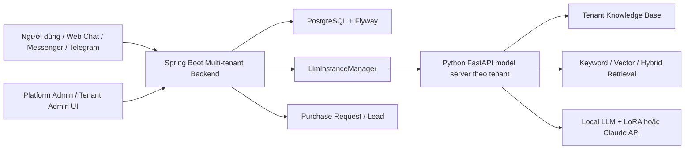

# Multi-tenant RAG chatbot hỗ trợ tư vấn bán hàng, so sánh và tham chiếu giá sản phẩm nội thất

Đồ án tốt nghiệp kỳ 2025.2 của sinh viên Lê Văn Pháp, MSSV 20226118. Đề tài tập trung xây dựng hệ thống chatbot AI cho cửa hàng nội thất nhỏ và vừa, nơi khách hàng thường cần tư vấn đa lượt trước khi ra quyết định mua: hỏi theo nhu cầu, thay đổi ngân sách, đổi loại sản phẩm, từ chối gợi ý, yêu cầu so sánh và cuối cùng để lại thông tin mua hàng.

Sản phẩm trong repo hiện tại là một hệ thống multi-tenant gồm backend Spring Boot và AI service FastAPI. Mỗi cửa hàng/tenant có chatbot, dữ liệu knowledge base, cấu hình model và kênh giao tiếp riêng, nhưng vận hành trên cùng một platform.

## Mục tiêu đề tài

Hệ thống cần giải quyết ba nhóm nhu cầu chính:

- Tư vấn bán hàng theo từng cửa hàng nội thất: chatbot dùng knowledge base riêng của cửa hàng, ghi nhớ hội thoại, gợi ý sản phẩm và tạo yêu cầu mua hàng khi đủ thông tin.
- Tư vấn và so sánh chung: chatbot trên website hệ thống hỗ trợ người dùng tham khảo, so sánh sản phẩm nội thất từ dữ liệu tổng hợp, không tạo lead/purchase request.
- Tham chiếu thị trường: phân tích khoảng giá, mức giá phổ biến và cảnh báo giá bất thường cho từng nhóm sản phẩm.

Repo hiện đã hiện thực rõ nhất luồng `tenant_sales` và phần lớn hạ tầng multi-tenant/API/UI. Luồng `general_consumer` đang đóng vai trò tư vấn nội thất tổng quát và là nền cho chế độ tư vấn/so sánh chung. Dữ liệu tham chiếu giá đã có trong `chatbot/kb/price_reference.json` và logic hỗ trợ nằm trong `chatbot/app/guardrails.py`, nhưng hiện chưa được tách thành REST API tham chiếu giá độc lập.

## Chức năng chính

- Quản lý tenant/cửa hàng, chatbot, thành viên, hội thoại và yêu cầu mua hàng.
- Chatbot RAG theo tenant: mỗi tenant trỏ tới một `kb_dir` riêng gồm `docs.jsonl`, `chunks.jsonl`, `index.json`.
- AI service xử lý hội thoại đa lượt, ghi nhớ stage/slot như loại sản phẩm, ngân sách, phong cách, không gian, trẻ em/thú cưng.
- Tư vấn theo flow bán hàng: discover, propose, compare, close, handoff.
- Tạo purchase request khi khách xác nhận trong luồng chốt đơn.
- Tích hợp web chat, Facebook Messenger webhook và Telegram webhook.
- Giao diện quản trị platform và tenant để xem tenant, chatbot, hội thoại, knowledge base, runtime và purchase request.
- Công cụ crawl website, build knowledge base và benchmark retrieval.
- Hỗ trợ nhiều cấu hình model: local Hugging Face model + LoRA hoặc provider API như Claude.

## Kiến trúc hệ thống



Luồng chat chính:

1. Người dùng gửi tin qua web chat hoặc webhook Messenger/Telegram.
2. Spring Boot xác định tenant bằng `X-API-Key`, session đăng nhập hoặc channel binding.
3. Spring lấy chatbot config và `kb_dir` của tenant từ PostgreSQL.
4. `LlmInstanceManager` khởi động Python FastAPI process riêng cho tenant nếu chưa có.
5. Spring gọi Python `POST /chat` với `message`, `history`, `gen`, `conversation_id`, `channel`, `tenant_id`.
6. Python áp dụng guardrails, state machine tư vấn, retrieval từ KB và gọi model để sinh câu trả lời.
7. Spring lưu hội thoại, trả response cho client và tạo purchase request nếu AI service trigger điều kiện chốt đơn.

## Công nghệ sử dụng

Backend nghiệp vụ:

- Java 21.
- Spring Boot 3.5.7.
- Spring Web, Spring WebFlux.
- Spring Security, session/RBAC cho platform admin, tenant admin, tenant member.
- Spring Data JPA.
- Flyway.
- PostgreSQL 16.
- Lombok.

AI service và RAG:

- Python 3.11.
- FastAPI 0.115.0, Uvicorn 0.30.6.
- Transformers 4.44.2, PEFT 0.12.0, Accelerate 0.34.2, PyTorch >= 2.3.0.
- Qwen/Qwen2.5-1.5B-Instruct làm model local mặc định trong code.
- TinyLlama/TinyLlama-1.1B-Chat-v1.0 làm default Docker demo để cold start nhẹ hơn.
- Claude 3.5 Sonnet qua Anthropic-compatible API khi chatbot config dùng provider API.
- BeautifulSoup4, lxml, requests để thu thập dữ liệu.
- Retriever keyword baseline, vector, hybrid, hybrid rerank trong `chatbot/app/retrievers`.

Triển khai và kiểm thử:

- Docker Desktop, Docker Compose.
- Maven.
- Postman collection trong `multitenant/docs/postman`.
- Python eval runner trong `chatbot/eval`.

## Cấu trúc thư mục

```text
.
├── README.md
├── docker-compose.yml
├── docs/
│   ├── docker-local-demo.md
│   ├── REGRESSION_CHECKLIST.md
│   └── vietnamese-buyer-progress-summary.md
├── diagram/
│   ├── Kiến trúc tổng thể.png
│   ├── erd.png
│   ├── MainClassDiagram.png
│   └── SequenceDiagram.png
├── chatbot/
│   ├── app/
│   │   ├── server.py                  # FastAPI /chat, /healthz, /state, /feedback
│   │   ├── model_loader.py            # Load local model/LoRA pipeline
│   │   ├── retriever.py               # SimpleKb đang được server.py dùng trực tiếp
│   │   ├── retrieval_service.py       # Boundary mới cho retriever chuẩn hóa
│   │   ├── retrievers/                # baseline, vector, hybrid, hybrid_rerank
│   │   ├── sales_flow.py              # Flow tenant_sales
│   │   ├── consultation.py            # Flow general_consumer
│   │   ├── state.py                   # State hội thoại theo conversation_id
│   │   ├── guardrails.py              # Handoff, tồn kho, mặc cả, giá tham chiếu
│   │   └── prompt.py
│   ├── kb/
│   │   ├── article/
│   │   ├── castlery/
│   │   ├── noithatcaco/
│   │   └── price_reference.json
│   ├── tools/
│   │   ├── scrape_site.py
│   │   ├── build_kb.py
│   │   └── run_vietnamese_retrieval_regression.py
│   ├── eval/
│   │   ├── dataset.jsonl
│   │   ├── runner.py
│   │   └── results-summary.md
│   ├── training/
│   ├── adapters/
│   ├── tests/
│   ├── requirements.txt
│   ├── requirements-docker.txt
│   └── Dockerfile
├── multitenant/
│   ├── src/main/java/com/app/
│   │   ├── admin/                     # Platform admin APIs
│   │   ├── auth/                      # Login/session/RBAC
│   │   ├── bots/                      # ChatbotInstance APIs
│   │   ├── chat/                      # Tenant chat + general chat
│   │   ├── kb/                        # Source URLs + rebuild KB
│   │   ├── leads/                     # Lead flow
│   │   ├── messenger/                 # Messenger binding/webhook/send
│   │   ├── modelserver/               # Spawn/call Python model server
│   │   ├── ops/                       # Runtime/benchmark/platform ops
│   │   ├── purchases/                 # Purchase request lifecycle
│   │   ├── telegram/                  # Telegram binding/webhook/send
│   │   └── tenants/
│   ├── src/main/resources/
│   │   ├── application.yml
│   │   ├── db/migration/
│   │   └── static/                    # admin, tenant, login, chat UI
│   ├── docs/
│   ├── pom.xml
│   └── Dockerfile
├── datasetv2/
└── references/
```

## Các chế độ sản phẩm

### 1. Tư vấn bán hàng theo cửa hàng

Mode: `tenant_sales`.

Đây là luồng bám sát code nhất trong repo. Chatbot được cấu hình theo tenant và dùng KB riêng để tư vấn. Python service quản lý stage/slot, Spring lưu hội thoại và tạo purchase request khi khách gửi xác nhận trong giai đoạn close.

Các tình huống đã có hỗ trợ:

- Hỏi sản phẩm theo nhu cầu, phòng sử dụng, phong cách.
- Nhận diện ngân sách, không gian nhỏ, trẻ em/thú cưng, chất liệu/phong cách.
- Thay đổi nhu cầu hoặc chủ đề sản phẩm.
- Từ chối gợi ý, hỏi sản phẩm tương tự.
- Handoff sang nhân viên.
- Chốt nhu cầu và tạo purchase request.

### 2. Tư vấn và so sánh chung

Mode: `general_consumer`.

Code hiện tại có `GeneralChatController` và mode `general_consumer` trong Python để trả lời tư vấn nội thất tổng quát, không dùng flow purchase request của tenant sales. Đây là nền cho yêu cầu trong phiếu: chatbot website dùng dữ liệu tổng hợp để tư vấn/so sánh và không tạo lead tự động.

Trong repo, khả năng so sánh đang nằm ở mức hội thoại/RAG và prompt, chưa có endpoint so sánh sản phẩm dạng bảng riêng. Các truy vấn so sánh vẫn đi qua `/api/general/chat/send` hoặc Python `/chat`.

### 3. Tham chiếu thị trường và giá

Phiếu giao nhiệm vụ yêu cầu phân tích khoảng giá, mức phổ biến và phát hiện giá bất thường. Repo hiện có:

- File dữ liệu: `chatbot/kb/price_reference.json`.
- Logic nhận diện danh mục/giá và format phản hồi trong `chatbot/app/guardrails.py`.
- Demo scenario trong `chatbot/docs/demo-scenarios.md`.

Trạng thái theo code hiện tại: phần tham chiếu giá chưa được expose thành nhóm REST API riêng trong Spring Boot; nếu cần đúng hoàn toàn với phiếu, bước tiếp theo là nối logic price reference vào `rule_reply` hoặc tạo endpoint/API riêng cho tham chiếu giá.

## Biến môi trường

### Spring Boot

| Biến | Mặc định | Ý nghĩa |
| --- | --- | --- |
| `SPRING_DATASOURCE_URL` | `jdbc:postgresql://localhost:5432/global_admin` | JDBC URL PostgreSQL |
| `SPRING_DATASOURCE_USERNAME` | `postgres` | User DB |
| `SPRING_DATASOURCE_PASSWORD` | `admin` | Password DB |
| `SERVER_PORT` | `8080` | Port backend |
| `PYTHON_BIN` | `python` | Python runtime có cài dependencies của `chatbot` |
| `MODEL_SERVER_DIR` | `../chatbot` | Thư mục chứa `app/server.py` |
| `LLM_HOST` | `127.0.0.1` | Host cho Python process |
| `LLM_PORT_START` | `8101` | Port bắt đầu cho tenant model server |
| `LLM_PORT_END` | `8199` | Port kết thúc cho tenant model server |
| `LLM_HEALTH_PATH` | `/healthz` | Health endpoint của Python |
| `LLM_UVICORN_MODULE` | `app.server:app` | Uvicorn module |
| `LLM_CONNECT_TIMEOUT_MS` | `2000` | Timeout connect |
| `LLM_RESPONSE_TIMEOUT_MS` | `120000` | Timeout phản hồi chat |
| `LLM_STARTUP_TIMEOUT_MS` | `120000` local, `600000` Docker | Timeout chờ model warmup |
| `MESSENGER_VERIFY_TOKEN` | `woodchat_secret` | Token verify webhook Messenger |

### Python AI service

| Biến | Mặc định | Ý nghĩa |
| --- | --- | --- |
| `KB_DIR` | rỗng | KB của process Python hiện tại |
| `BASE_MODEL` | `Qwen/Qwen2.5-1.5B-Instruct` | Model local mặc định |
| `LORA_ADAPTER` | rỗng | Đường dẫn LoRA adapter |
| `TOKENIZER_PATH` | rỗng | Tokenizer riêng |
| `MAX_NEW_TOKENS` | `256` | Số token sinh tối đa |
| `TEMPERATURE` | `0.7` | Sampling temperature |
| `TOP_P` | `0.9` | Nucleus sampling |
| `TOP_K` | `50` | Top-k sampling |

Docker Compose còn hỗ trợ:

- `POSTGRES_DB`, `POSTGRES_USER`, `POSTGRES_PASSWORD`, `POSTGRES_PORT`.
- `APP_PORT`.
- `BASE_MODEL` cho service `app`.
- `CHATBOT_KB_DIR`, `CHATBOT_BASE_MODEL`, `CHATBOT_LORA_ADAPTER`, `CHATBOT_TOKENIZER_PATH` cho optional `chatbot-api`.

Chatbot instance trong database có thể cấu hình thêm: `base_model`, `adapter_path`, `tokenizer_path`, `system_prompt`, generation params, `response_style`, `mode`, `provider`, `api_model`, `api_key`, `api_base_url`.

## Cài đặt

### Yêu cầu môi trường

- Java 21.
- Maven 3.9+ hoặc `multitenant/mvnw`.
- Python 3.11.
- PostgreSQL 16 nếu chạy local.
- Docker Desktop nếu chạy Compose.
- Dung lượng trống cho Hugging Face model cache.

### Cài Python dependencies

```powershell
cd F:\20251\prj3\chatbot
py -3.11 -m venv .venv
.\.venv\Scripts\Activate.ps1
pip install -r requirements.txt
```

### Build Spring Boot

```powershell
cd F:\20251\prj3\multitenant
mvn -q -DskipTests package
```

### Chuẩn bị database local

Tạo PostgreSQL database `global_admin`. Spring Boot tự chạy Flyway migrations khi start.

Seed dữ liệu demo 2 tenant:

```powershell
psql -U postgres -d global_admin -f F:\20251\prj3\multitenant\docs\sql\demo_multi_tenant_setup.sql
```

Lưu ý: seed demo dùng path Windows như `F:/20251/prj3/chatbot/kb/article`. Nếu chạy Docker, `kb_dir` trong DB nên trỏ tới path container như `/opt/app/chatbot/kb/article`.

### Build knowledge base

Ví dụ Article:

```powershell
cd F:\20251\prj3\chatbot
python tools\scrape_site.py article kb\article\raw_urls.txt kb\article\docs.jsonl
python tools\build_kb.py kb\article\docs.jsonl kb\article\chunks.jsonl kb\article\index.json
```

Ví dụ Castlery:

```powershell
cd F:\20251\prj3\chatbot
python tools\scrape_site.py castlery kb\castlery\raw_urls.txt kb\castlery\docs.jsonl
python tools\build_kb.py kb\castlery\docs.jsonl kb\castlery\chunks.jsonl kb\castlery\index.json
```

KB mẫu hiện có:

- `chatbot/kb/noithatcaco`
- `chatbot/kb/article`
- `chatbot/kb/castlery`

## Cách chạy từng service

### Chạy toàn bộ stack bằng Docker Compose

```powershell
cd F:\20251\prj3
docker compose up --build
```

Detached:

```powershell
docker compose up --build -d
```

Service mặc định:

- PostgreSQL: `localhost:5432`.
- Spring Boot/API/UI: `http://localhost:8080`.
- Python model server theo tenant: Spring tự spawn trên dải port `8101-8199`.

Dừng stack:

```powershell
docker compose down
```

Dừng và xóa volume DB:

```powershell
docker compose down -v
```

### Chạy Spring Boot local

```powershell
$env:PYTHON_BIN="F:\20251\prj3\chatbot\.venv\Scripts\python.exe"
$env:MODEL_SERVER_DIR="F:\20251\prj3\chatbot"
$env:SPRING_DATASOURCE_URL="jdbc:postgresql://localhost:5432/global_admin"
$env:SPRING_DATASOURCE_USERNAME="postgres"
$env:SPRING_DATASOURCE_PASSWORD="admin"
$env:MESSENGER_VERIFY_TOKEN="woodchat_secret"
cd F:\20251\prj3\multitenant
mvn spring-boot:run
```

UI:

- `http://localhost:8080/login`
- `http://localhost:8080/admin`
- `http://localhost:8080/tenant`
- `http://localhost:8080/chat`

### Chạy Python FastAPI độc lập

Luồng end-to-end không cần chạy Python thủ công vì Spring tự spawn. Lệnh dưới đây chỉ dùng để smoke test AI service.

```powershell
cd F:\20251\prj3\chatbot
.\.venv\Scripts\Activate.ps1
$env:KB_DIR="F:\20251\prj3\chatbot\kb\article"
uvicorn app.server:app --host 0.0.0.0 --port 8000
```

Swagger UI: `http://localhost:8000/docs`.

Optional Docker service:

```powershell
cd F:\20251\prj3
docker compose --profile chatbot-api up --build
```

## Demo flow giữa kỳ

### Flow 1: Tư vấn bán hàng và tạo purchase request

Tenant demo CaCo:

- API key: `029269d7f5f445f7ac36c196dffa134e`
- Chatbot id: `e08a7b4f-ebfb-4874-a119-b90e95e85fc7`
- KB: `chatbot/kb/noithatcaco`
- Mode: `tenant_sales`

Start chat:

```powershell
curl -X POST http://localhost:8080/api/chat/start `
  -H "Content-Type: application/json" `
  -H "X-API-Key: 029269d7f5f445f7ac36c196dffa134e" `
  -d "{\"chatbotId\":\"e08a7b4f-ebfb-4874-a119-b90e95e85fc7\"}"
```

Gửi các lượt hội thoại:

```text
Xin chao, toi muon mua sofa cho phong khach nho.
Ten toi la Nguyen Van A, so dien thoai la 0912345678.
Dia chi nhan hang cua toi la 123 Nguyen Trai, Ha Noi.
CONFIRM
```

Mỗi lượt gửi qua:

```powershell
curl -X POST http://localhost:8080/api/chat/send `
  -H "Content-Type: application/json" `
  -H "X-API-Key: 029269d7f5f445f7ac36c196dffa134e" `
  -d "{\"conversationId\":\"<conversationId>\",\"message\":\"<message>\"}"
```

Kết quả cần thấy:

- Bot tư vấn sofa theo ngữ cảnh.
- Bot ghi nhận tên, số điện thoại, địa chỉ qua transcript/state.
- `CONFIRM` tạo purchase request.
- Vào `http://localhost:8080/admin` hoặc tenant UI để xem request mới và đổi trạng thái `NEW -> CONTACTED -> COMPLETED`.

### Flow 2: Multi-tenant RAG

Tenant A - Demo CaCo:

- API key: `029269d7f5f445f7ac36c196dffa134e`
- Chatbot id: `e08a7b4f-ebfb-4874-a119-b90e95e85fc7`
- KB: `chatbot/kb/noithatcaco`

Tenant B - Demo Article:

- API key: `a4b9d130f0d34f74ac6b54cf8d6d2e11`
- Chatbot id: `5fd0f6f4-c0b8-4e4e-9d7b-4b65f4c3998b`
- KB: `chatbot/kb/article`

Cùng gửi câu hỏi:

```text
I need a sofa for a small living room. What would you recommend?
```

Điểm demo:

- Tenant A trả lời theo dữ liệu CaCo/noithatcaco.
- Tenant B trả lời theo dữ liệu Article.
- Sự khác biệt đến từ `tenant.kb_dir`, không phải do tách backend.

### Flow 3: Tư vấn chung và tham chiếu giá

Mode `general_consumer` dùng để demo tư vấn nội thất tổng quát:

```text
How do I choose the right sofa size for my small living room?
```

Các scenario tham chiếu giá có trong `chatbot/docs/demo-scenarios.md`:

```text
What is the typical price range for dining tables?
Is $800 a good price for a sofa?
Is 4 triệu VND reasonable for a bed?
```

Ghi chú trạng thái: tài liệu demo có scenario giá, dữ liệu giá có trong repo, nhưng code hiện tại cần nối thêm logic guardrail/endpoint nếu muốn demo tham chiếu giá chạy chắc chắn qua API.

## API chính

### Chat tenant

`POST /api/chat/start`

```json
{
  "chatbotId": "e08a7b4f-ebfb-4874-a119-b90e95e85fc7",
  "userExternalId": "optional-user-id"
}
```

`POST /api/chat/send`

```json
{
  "conversationId": "...",
  "message": "I need a sofa for a small living room."
}
```

Response:

```json
{
  "reply": "...",
  "latencyMs": 842,
  "model": "Qwen/Qwen2.5-1.5B-Instruct",
  "adapter": "",
  "llmBaseUrl": "http://127.0.0.1:8101"
}
```

Endpoint phụ:

- `GET /api/chat/conversations?chatbotId=<uuid>&limit=50`
- `GET /api/chat/conversation/{conversationId}/messages`
- `PUT /api/chat/conversation/{conversationId}/rename`
- `DELETE /api/chat/conversation/{conversationId}`

### Chat tư vấn chung

- `POST /api/general/chat/start`
- `POST /api/general/chat/send`
- `GET /api/general/chat/conversations`
- `GET /api/general/chat/conversation/{conversationId}/messages`
- `PUT /api/general/chat/conversation/{conversationId}/rename`
- `DELETE /api/general/chat/conversation/{conversationId}`

### Quản lý chatbot

- `GET /api/chatbots`
- `POST /api/chatbots`
- `PUT /api/chatbots/{id}`

Payload:

```json
{
  "name": "Article Sales Bot",
  "channel": "web",
  "personaJson": "{\"tone\":\"friendly\"}",
  "responseStyle": "natural",
  "mode": "tenant_sales",
  "provider": "local",
  "apiModel": "",
  "apiKey": "",
  "apiBaseUrl": ""
}
```

### Quản trị tenant và người dùng

- `POST /api/admin/tenants`
- `GET /api/admin/tenants`
- `GET /api/admin/tenants/{tenantId}`
- `GET /api/admin/tenant-members`
- `POST /api/admin/tenant-members`
- `GET /api/tenant-members`
- `POST /api/tenant-members`
- `POST /api/login/admin`
- `POST /api/login/tenant`
- `POST /api/login/logout`
- `GET /api/me`

### Knowledge base

- `GET /api/kb/source-urls`
- `POST /api/kb/source-urls`
- `DELETE /api/kb/source-urls`
- `POST /api/kb/rebuild`

### Purchase request

- `GET /api/purchase-requests?status=NEW`
- `PUT /api/purchase-requests/{id}/status`
- `PUT /api/purchase-requests/{id}/claim`
- `PUT /api/purchase-requests/{id}/assign`

### Messenger và Telegram

- `GET /api/messenger/bindings`
- `POST /api/messenger/bindings`
- `DELETE /api/messenger/bindings/{id}`
- `GET /webhook/messenger`
- `POST /webhook/messenger`
- `GET /api/telegram/bindings`
- `POST /api/telegram/bindings`
- `POST /webhook/telegram/{secretPath}`

### Runtime/Ops/Stats

- `GET /api/runtime/llm`
- `GET /api/ops/platform`
- `GET /api/ops/tenant`
- `GET /api/ops/benchmark-summary`
- `POST /api/ops/runtime/evict`
- `GET /admin/api/stats/overview`
- `GET /admin/api/stats/by-tenant`
- `GET /admin/api/stats/timeseries`

### Python AI service

Spring gọi các endpoint này trên Python process theo tenant:

- `GET /healthz`
- `POST /chat`
- `GET /state?conversation_id=<id>`
- `POST /feedback`

Contract thật của `POST /chat` theo code:

```json
{
  "message": "What sofa would fit a small apartment?",
  "history": ["I need a sofa for a condo"],
  "gen": {
    "base_model": "Qwen/Qwen2.5-1.5B-Instruct",
    "adapter": "F:/models/lora_style_a",
    "tokenizer_path": "F:/models/tokenizer",
    "system_prompt": "You are a helpful furniture sales assistant.",
    "max_new_tokens": 256,
    "temperature": 0.7,
    "top_p": 0.9,
    "top_k": 50,
    "stop": ["## Instruction:", "</s>"],
    "provider": "local",
    "api_model": "",
    "api_key": "",
    "api_base_url": "",
    "mode": "tenant_sales"
  },
  "conversation_id": "...",
  "channel": "web",
  "tenant_id": "..."
}
```

Response:

```json
{
  "reply": "...",
  "latency_ms": 842,
  "model": "Qwen/Qwen2.5-1.5B-Instruct",
  "adapter": null,
  "trigger_purchase_request": false,
  "captured_phone": null,
  "captured_name": null
}
```

Không dùng contract cũ `query`, `retrieval_mode`, `answer`, `citations` cho luồng Spring hiện tại.

## Dữ liệu và đánh giá

Dữ liệu trong repo:

- KB theo tenant: `article`, `castlery`, `noithatcaco`.
- Price reference: `chatbot/kb/price_reference.json`.
- Dataset train/eval: `datasetv2`, `chatbot/training/data`, `chatbot/eval/dataset.jsonl`.
- Logs: `chatbot/logs/chat.jsonl`, `chatbot/logs/feedback.jsonl`.

Benchmark retrieval hiện có:

```powershell
cd F:\20251\prj3
python chatbot\eval\runner.py --dataset chatbot\eval\dataset.jsonl --kb-dir chatbot\kb\noithatcaco --top-k 5 --compare
```

Kết quả đang được ghi trong `chatbot/eval/results-summary.md`:

| Mode | Recall@5 | MRR |
| --- | ---: | ---: |
| keyword | 0.7917 | 0.7333 |
| vector | 0.6667 | 0.4639 |
| hybrid | 0.7917 | 0.6708 |
| hybrid_rerank | 0.7708 | 0.6285 |

Kết quả này bám mục tiêu trong phiếu: so sánh TF-IDF/keyword baseline, vector retrieval và hybrid retrieval bằng Recall@5/MRR.

## Kiểm thử

Spring Boot:

```powershell
cd F:\20251\prj3\multitenant
mvn test
```

Một số nhóm test hẹp:

```powershell
mvn -q "-Dtest=ChatbotControllerTest,AdminUiControllerTest,PythonChatClientTest" test
mvn -q "-Dtest=PurchaseRequestServiceTest,PurchaseRequestControllerTest" test
mvn -q "-Dtest=TenantKbSourceControllerTest,TenantKbRebuildControllerTest" test
```

Python:

```powershell
cd F:\20251\prj3\chatbot
python -m unittest discover -s tests
python eval\runner.py --dataset eval\dataset.jsonl --kb-dir kb\noithatcaco --top-k 5 --compare
```

## Ghi chú bám code hiện tại

- Spring Boot vẫn là service nghiệp vụ chính; optional `chatbot-api` trong Docker chỉ dùng smoke test, không phải đường tích hợp mặc định.
- Spring spawn Python model server theo tenant để mỗi process nhận một `KB_DIR` riêng.
- `chatbot/app/server.py` hiện đang dùng `SimpleKb` từ `chatbot/app/retriever.py`; package `chatbot/app/retrievers` và `retrieval_service.py` phục vụ hướng refactor/benchmark retrieval.
- API tham chiếu giá độc lập là yêu cầu trong phiếu nhưng chưa có controller riêng trong Spring Boot.
- So sánh sản phẩm dạng bảng là yêu cầu sản phẩm kỳ vọng; hiện repo hỗ trợ qua hội thoại/RAG và demo scenario, chưa có response schema riêng cho bảng so sánh.
- File `chatbot/docs/api-contract.md` còn mô tả contract cũ; contract tích hợp đúng hiện tại là `multitenant/docs/api-contract.md` và DTO trong `multitenant/src/main/java/com/app/modelserver/dto`.
