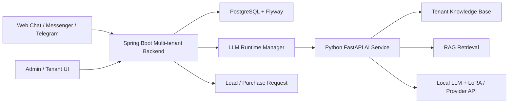

# Multi-tenant RAG Chatbot tư vấn sản phẩm nội thất

Hệ thống chatbot AI hỗ trợ tư vấn bán hàng, gợi ý sản phẩm và quản lý yêu cầu mua hàng cho các cửa hàng nội thất. Sản phẩm được xây dựng theo mô hình multi-tenant: mỗi cửa hàng có dữ liệu, chatbot, cấu hình mô hình và kênh giao tiếp riêng, trong khi vẫn dùng chung một nền tảng backend và giao diện quản trị.

Chatbot sử dụng RAG để truy xuất knowledge base của từng cửa hàng, kết hợp mô hình ngôn ngữ để trả lời theo ngữ cảnh hội thoại. Hệ thống phù hợp với các kịch bản tư vấn nội thất đa lượt, nơi khách hàng có thể thay đổi ngân sách, đổi nhu cầu, hỏi sản phẩm tương tự, yêu cầu so sánh hoặc để lại thông tin mua hàng.

## Tính năng chính

- Quản lý nhiều tenant/cửa hàng trên cùng một hệ thống.
- Quản lý chatbot theo từng tenant, gồm persona, kênh, mode, provider và cấu hình sinh câu trả lời.
- Xây dựng knowledge base riêng cho từng cửa hàng từ dữ liệu website hoặc tài liệu sản phẩm.
- Chatbot RAG tư vấn sản phẩm nội thất dựa trên dữ liệu cửa hàng.
- Hội thoại đa lượt có trạng thái, ghi nhớ nhu cầu, ngân sách, phong cách, không gian và các ràng buộc của khách hàng.
- Hỗ trợ luồng tư vấn bán hàng: khám phá nhu cầu, đề xuất, so sánh, chốt nhu cầu và chuyển tiếp nhân viên.
- Tạo purchase request từ hội thoại khi khách xác nhận mua hàng.
- Quản lý danh sách yêu cầu mua hàng và cập nhật trạng thái xử lý.
- Tích hợp web chat, Facebook Messenger và Telegram.
- Giao diện quản trị cho platform admin và tenant admin.
- Công cụ crawl dữ liệu, build knowledge base và đánh giá chất lượng retrieval.
- Hỗ trợ chạy model local bằng Hugging Face/LoRA hoặc dùng provider API theo cấu hình chatbot.

## Ba chế độ hoạt động

### 1. Tư vấn bán hàng theo cửa hàng

Chế độ này phục vụ từng tenant/cửa hàng riêng. Chatbot sử dụng knowledge base của cửa hàng để tư vấn sản phẩm, trả lời câu hỏi về sản phẩm/chính sách, ghi nhớ nhu cầu khách hàng và hỗ trợ chốt yêu cầu mua hàng.

Các khả năng chính:

- Tư vấn theo nhu cầu, phòng sử dụng, ngân sách, phong cách, chất liệu và kích thước.
- Gợi ý sản phẩm từ knowledge base riêng của cửa hàng.
- Xử lý hội thoại đa lượt khi khách đổi ngân sách, đổi nhu cầu hoặc từ chối đề xuất.
- Gợi ý sản phẩm tương tự khi khách muốn lựa chọn khác.
- Thu thập thông tin khách hàng và tạo purchase request khi khách xác nhận.
- Tích hợp với web chat, Messenger và Telegram của từng cửa hàng.

### 2. Tư vấn và so sánh chung

Chế độ này phục vụ người dùng trên website hệ thống. Chatbot hỗ trợ tư vấn nội thất tổng quát, gợi ý hướng lựa chọn và so sánh các phương án theo nhu cầu của người dùng.

Các khả năng chính:

- Tư vấn cách chọn sản phẩm nội thất theo diện tích, công năng, phong cách và ngân sách.
- Hỗ trợ so sánh các lựa chọn theo tiêu chí như giá, chất liệu, kích thước, phong cách và mức phù hợp với không gian.
- Gợi ý nhiều phương án để người dùng tham khảo trước khi quyết định.
- Duy trì hội thoại tư vấn mà không gắn với quy trình tạo đơn mua hàng của một cửa hàng cụ thể.

### 3. Tham chiếu thị trường và giá

Chế độ này hỗ trợ người dùng tham khảo mặt bằng giá cho các nhóm sản phẩm nội thất. Hệ thống dùng dữ liệu giá tham chiếu để trả lời các câu hỏi về khoảng giá, mức giá phổ biến và đánh giá sơ bộ một mức giá cụ thể.

Các khả năng chính:

- Trả lời khoảng giá điển hình của các nhóm sản phẩm như sofa, bàn, ghế, giường, tủ.
- So sánh giá người dùng đưa ra với mức trung bình tham chiếu.
- Phân loại mức giá theo hướng thấp hơn, nằm trong khoảng phổ biến hoặc cao hơn mặt bằng tham chiếu.
- Hỗ trợ câu hỏi bằng tiếng Việt và tiếng Anh cho các tình huống tham khảo giá.

## Kiến trúc hệ thống



Luồng xử lý chat:

1. Người dùng gửi tin nhắn qua web chat, Messenger hoặc Telegram.
2. Backend xác định tenant, chatbot và conversation tương ứng.
3. Backend lấy cấu hình chatbot và knowledge base của tenant.
4. Python AI service truy xuất dữ liệu liên quan từ knowledge base.
5. Prompt được dựng từ system prompt, lịch sử hội thoại, trạng thái tư vấn và context RAG.
6. Mô hình ngôn ngữ sinh câu trả lời.
7. Backend lưu hội thoại, trả phản hồi cho người dùng và tạo purchase request khi hội thoại đạt điều kiện chốt nhu cầu.

## Công nghệ sử dụng

Backend:

- Java 21.
- Spring Boot 3.5.7.
- Spring Web, Spring WebFlux.
- Spring Security.
- Spring Data JPA.
- PostgreSQL 16.
- Flyway.
- Lombok.

AI service:

- Python 3.11.
- FastAPI 0.115.0.
- Uvicorn 0.30.6.
- Transformers 4.44.2.
- PEFT 0.12.0.
- Accelerate 0.34.2.
- PyTorch >= 2.3.0.
- BeautifulSoup4, lxml, requests.

RAG và đánh giá:

- Keyword/Baseline retrieval.
- Vector retrieval.
- Hybrid retrieval.
- Hybrid rerank retrieval.
- Recall@k và MRR cho benchmark retrieval.

Triển khai:

- Docker.
- Docker Compose.
- Maven.
- Postman.

## Cấu trúc thư mục

```text
.
├── README.md
├── docker-compose.yml
├── docs/
├── diagram/
├── chatbot/
│   ├── app/
│   │   ├── server.py
│   │   ├── model_loader.py
│   │   ├── retriever.py
│   │   ├── retrieval_service.py
│   │   ├── retrievers/
│   │   ├── sales_flow.py
│   │   ├── consultation.py
│   │   ├── state.py
│   │   ├── guardrails.py
│   │   └── prompt.py
│   ├── kb/
│   │   ├── article/
│   │   ├── castlery/
│   │   └── noithatcaco/
│   ├── tools/
│   ├── eval/
│   ├── training/
│   ├── adapters/
│   ├── tests/
│   ├── requirements.txt
│   ├── requirements-docker.txt
│   └── Dockerfile
├── multitenant/
│   ├── src/main/java/com/app/
│   │   ├── admin/
│   │   ├── auth/
│   │   ├── bots/
│   │   ├── chat/
│   │   ├── kb/
│   │   ├── leads/
│   │   ├── messenger/
│   │   ├── modelserver/
│   │   ├── ops/
│   │   ├── purchases/
│   │   ├── telegram/
│   │   └── tenants/
│   ├── src/main/resources/
│   │   ├── application.yml
│   │   ├── db/migration/
│   │   └── static/
│   ├── docs/
│   ├── pom.xml
│   └── Dockerfile
└── datasetv2/
```

## Biến môi trường

### Backend Spring Boot

| Biến | Mặc định | Mô tả |
| --- | --- | --- |
| `SPRING_DATASOURCE_URL` | `jdbc:postgresql://localhost:5432/global_admin` | JDBC URL PostgreSQL |
| `SPRING_DATASOURCE_USERNAME` | `postgres` | Tài khoản database |
| `SPRING_DATASOURCE_PASSWORD` | `admin` | Mật khẩu database |
| `SERVER_PORT` | `8080` | Port backend |
| `PYTHON_BIN` | `python` | Python runtime chạy AI service |
| `MODEL_SERVER_DIR` | `../chatbot` | Thư mục Python chatbot |
| `LLM_HOST` | `127.0.0.1` | Host model server |
| `LLM_PORT_START` | `8101` | Port bắt đầu cho model server theo tenant |
| `LLM_PORT_END` | `8199` | Port kết thúc cho model server theo tenant |
| `LLM_HEALTH_PATH` | `/healthz` | Health endpoint |
| `LLM_UVICORN_MODULE` | `app.server:app` | Uvicorn module |
| `LLM_CONNECT_TIMEOUT_MS` | `2000` | Timeout kết nối tới AI service |
| `LLM_RESPONSE_TIMEOUT_MS` | `120000` | Timeout phản hồi chat |
| `LLM_STARTUP_TIMEOUT_MS` | `120000` | Timeout chờ warmup |
| `MESSENGER_VERIFY_TOKEN` | `woodchat_secret` | Token verify webhook Messenger |

### Python AI service

| Biến | Mặc định | Mô tả |
| --- | --- | --- |
| `KB_DIR` | rỗng | Thư mục knowledge base của process |
| `BASE_MODEL` | `Qwen/Qwen2.5-1.5B-Instruct` | Model local |
| `LORA_ADAPTER` | rỗng | Đường dẫn LoRA adapter |
| `TOKENIZER_PATH` | rỗng | Tokenizer tùy chỉnh |
| `MAX_NEW_TOKENS` | `256` | Số token sinh tối đa |
| `TEMPERATURE` | `0.7` | Sampling temperature |
| `TOP_P` | `0.9` | Nucleus sampling |
| `TOP_K` | `50` | Top-k sampling |

Các biến Docker Compose thường dùng:

- `POSTGRES_DB`
- `POSTGRES_USER`
- `POSTGRES_PASSWORD`
- `POSTGRES_PORT`
- `APP_PORT`
- `BASE_MODEL`
- `CHATBOT_KB_DIR`
- `CHATBOT_BASE_MODEL`
- `CHATBOT_LORA_ADAPTER`
- `CHATBOT_TOKENIZER_PATH`

## Cài đặt

### Yêu cầu

- Java 21.
- Maven 3.9+.
- Python 3.11.
- PostgreSQL 16.
- Docker Desktop nếu chạy bằng Docker Compose.

### Cài Python dependencies

```powershell
cd F:\20251\prj3\chatbot
py -3.11 -m venv .venv
.\.venv\Scripts\Activate.ps1
pip install -r requirements.txt
```

### Build backend

```powershell
cd F:\20251\prj3\multitenant
mvn -q -DskipTests package
```

### Chuẩn bị database

Tạo PostgreSQL database:

```sql
CREATE DATABASE global_admin;
```

Seed dữ liệu demo:

```powershell
psql -U postgres -d global_admin -f F:\20251\prj3\multitenant\docs\sql\demo_multi_tenant_setup.sql
```

## Xây dựng knowledge base

Ví dụ build KB cho Article:

```powershell
cd F:\20251\prj3\chatbot
python tools\scrape_site.py article kb\article\raw_urls.txt kb\article\docs.jsonl
python tools\build_kb.py kb\article\docs.jsonl kb\article\chunks.jsonl kb\article\index.json
```

Ví dụ build KB cho Castlery:

```powershell
cd F:\20251\prj3\chatbot
python tools\scrape_site.py castlery kb\castlery\raw_urls.txt kb\castlery\docs.jsonl
python tools\build_kb.py kb\castlery\docs.jsonl kb\castlery\chunks.jsonl kb\castlery\index.json
```

Mỗi thư mục KB gồm:

- `raw_urls.txt`: danh sách URL nguồn.
- `docs.jsonl`: tài liệu đã crawl.
- `chunks.jsonl`: các chunk dùng cho retrieval.
- `index.json`: chỉ mục phục vụ tìm kiếm.

## Chạy hệ thống

### Chạy bằng Docker Compose

```powershell
cd F:\20251\prj3
docker compose up --build
```

Chạy nền:

```powershell
docker compose up --build -d
```

Các service:

- PostgreSQL: `localhost:5432`.
- Backend/API/UI: `http://localhost:8080`.
- Python model server theo tenant: backend tự quản lý trên dải port `8101-8199`.

Dừng hệ thống:

```powershell
docker compose down
```

### Chạy backend local

```powershell
$env:PYTHON_BIN="F:\20251\prj3\chatbot\.venv\Scripts\python.exe"
$env:MODEL_SERVER_DIR="F:\20251\prj3\chatbot"
$env:SPRING_DATASOURCE_URL="jdbc:postgresql://localhost:5432/global_admin"
$env:SPRING_DATASOURCE_USERNAME="postgres"
$env:SPRING_DATASOURCE_PASSWORD="admin"
$env:MESSENGER_VERIFY_TOKEN="woodchat_secret"
cd F:\20251\prj3\multitenant
mvn spring-boot:run
```

Giao diện:

- Login: `http://localhost:8080/login`
- Admin UI: `http://localhost:8080/admin`
- Tenant UI: `http://localhost:8080/tenant`
- Web chat: `http://localhost:8080/chat`

### Chạy AI service độc lập

```powershell
cd F:\20251\prj3\chatbot
.\.venv\Scripts\Activate.ps1
$env:KB_DIR="F:\20251\prj3\chatbot\kb\article"
uvicorn app.server:app --host 0.0.0.0 --port 8000
```

Swagger UI:

```text
http://localhost:8000/docs
```

## Demo flow

### 1. Tư vấn bán hàng và tạo purchase request

Tenant demo CaCo:

- API key: `029269d7f5f445f7ac36c196dffa134e`
- Chatbot id: `e08a7b4f-ebfb-4874-a119-b90e95e85fc7`
- KB: `chatbot/kb/noithatcaco`

Tạo phiên chat:

```powershell
curl -X POST http://localhost:8080/api/chat/start `
  -H "Content-Type: application/json" `
  -H "X-API-Key: 029269d7f5f445f7ac36c196dffa134e" `
  -d "{\"chatbotId\":\"e08a7b4f-ebfb-4874-a119-b90e95e85fc7\"}"
```

Kịch bản hội thoại:

```text
Xin chao, toi muon mua sofa cho phong khach nho.
Ten toi la Nguyen Van A, so dien thoai la 0912345678.
Dia chi nhan hang cua toi la 123 Nguyen Trai, Ha Noi.
CONFIRM
```

Gửi tin nhắn:

```powershell
curl -X POST http://localhost:8080/api/chat/send `
  -H "Content-Type: application/json" `
  -H "X-API-Key: 029269d7f5f445f7ac36c196dffa134e" `
  -d "{\"conversationId\":\"<conversationId>\",\"message\":\"<message>\"}"
```

Kết quả:

- Chatbot tư vấn theo nhu cầu mua sofa.
- Hệ thống lưu lịch sử hội thoại.
- Lệnh `CONFIRM` tạo purchase request.
- Nhân viên xử lý yêu cầu trong admin/tenant UI.

### 2. Multi-tenant RAG

Tenant A - Demo CaCo:

- API key: `029269d7f5f445f7ac36c196dffa134e`
- Chatbot id: `e08a7b4f-ebfb-4874-a119-b90e95e85fc7`
- KB: `chatbot/kb/noithatcaco`

Tenant B - Demo Article:

- API key: `a4b9d130f0d34f74ac6b54cf8d6d2e11`
- Chatbot id: `5fd0f6f4-c0b8-4e4e-9d7b-4b65f4c3998b`
- KB: `chatbot/kb/article`

Câu hỏi dùng để so sánh:

```text
I need a sofa for a small living room. What would you recommend?
```

Cùng một API chat trả lời theo dữ liệu và cấu hình riêng của từng tenant.

### 3. Tư vấn nội thất tổng quát

Tạo phiên chat:

```powershell
curl -X POST http://localhost:8080/api/general/chat/start
```

Gửi câu hỏi:

```powershell
curl -X POST http://localhost:8080/api/general/chat/send `
  -H "Content-Type: application/json" `
  -d "{\"conversationId\":\"<conversationId>\",\"message\":\"How do I choose the right sofa size for my small living room?\"}"
```

## API chính

### Chat theo tenant

`POST /api/chat/start`

```json
{
  "chatbotId": "e08a7b4f-ebfb-4874-a119-b90e95e85fc7",
  "userExternalId": "optional-user-id"
}
```

`POST /api/chat/send`

```json
{
  "conversationId": "...",
  "message": "I need a sofa for a small living room."
}
```

Response:

```json
{
  "reply": "...",
  "latencyMs": 842,
  "model": "Qwen/Qwen2.5-1.5B-Instruct",
  "adapter": "",
  "llmBaseUrl": "http://127.0.0.1:8101"
}
```

Các endpoint hội thoại:

- `GET /api/chat/conversations?chatbotId=<uuid>&limit=50`
- `GET /api/chat/conversation/{conversationId}/messages`
- `PUT /api/chat/conversation/{conversationId}/rename`
- `DELETE /api/chat/conversation/{conversationId}`

### Chat tư vấn chung

- `POST /api/general/chat/start`
- `POST /api/general/chat/send`
- `GET /api/general/chat/conversations`
- `GET /api/general/chat/conversation/{conversationId}/messages`
- `PUT /api/general/chat/conversation/{conversationId}/rename`
- `DELETE /api/general/chat/conversation/{conversationId}`

### Quản lý chatbot

- `GET /api/chatbots`
- `POST /api/chatbots`
- `PUT /api/chatbots/{id}`

Payload tạo/cập nhật chatbot:

```json
{
  "name": "Article Sales Bot",
  "channel": "web",
  "personaJson": "{\"tone\":\"friendly\"}",
  "responseStyle": "natural",
  "mode": "tenant_sales",
  "provider": "local",
  "apiModel": "",
  "apiKey": "",
  "apiBaseUrl": ""
}
```

### Quản trị tenant và thành viên

- `POST /api/admin/tenants`
- `GET /api/admin/tenants`
- `GET /api/admin/tenants/{tenantId}`
- `GET /api/admin/tenant-members`
- `POST /api/admin/tenant-members`
- `GET /api/tenant-members`
- `POST /api/tenant-members`
- `POST /api/login/admin`
- `POST /api/login/tenant`
- `POST /api/login/logout`
- `GET /api/me`

### Knowledge base

- `GET /api/kb/source-urls`
- `POST /api/kb/source-urls`
- `DELETE /api/kb/source-urls`
- `POST /api/kb/rebuild`

### Purchase request

- `GET /api/purchase-requests?status=NEW`
- `PUT /api/purchase-requests/{id}/status`
- `PUT /api/purchase-requests/{id}/claim`
- `PUT /api/purchase-requests/{id}/assign`

### Messenger và Telegram

- `GET /api/messenger/bindings`
- `POST /api/messenger/bindings`
- `DELETE /api/messenger/bindings/{id}`
- `GET /webhook/messenger`
- `POST /webhook/messenger`
- `GET /api/telegram/bindings`
- `POST /api/telegram/bindings`
- `POST /webhook/telegram/{secretPath}`

### Runtime, ops và thống kê

- `GET /api/runtime/llm`
- `GET /api/ops/platform`
- `GET /api/ops/tenant`
- `GET /api/ops/benchmark-summary`
- `POST /api/ops/runtime/evict`
- `GET /admin/api/stats/overview`
- `GET /admin/api/stats/by-tenant`
- `GET /admin/api/stats/timeseries`

### Python AI service

- `GET /healthz`
- `POST /chat`
- `GET /state?conversation_id=<id>`
- `POST /feedback`

Request `POST /chat`:

```json
{
  "message": "What sofa would fit a small apartment?",
  "history": ["I need a sofa for a condo"],
  "gen": {
    "base_model": "Qwen/Qwen2.5-1.5B-Instruct",
    "adapter": "F:/models/lora_style_a",
    "tokenizer_path": "F:/models/tokenizer",
    "system_prompt": "You are a helpful furniture sales assistant.",
    "max_new_tokens": 256,
    "temperature": 0.7,
    "top_p": 0.9,
    "top_k": 50,
    "stop": ["## Instruction:", "</s>"],
    "provider": "local",
    "api_model": "",
    "api_key": "",
    "api_base_url": "",
    "mode": "tenant_sales"
  },
  "conversation_id": "...",
  "channel": "web",
  "tenant_id": "..."
}
```

Response:

```json
{
  "reply": "...",
  "latency_ms": 842,
  "model": "Qwen/Qwen2.5-1.5B-Instruct",
  "adapter": null,
  "trigger_purchase_request": false,
  "captured_phone": null,
  "captured_name": null
}
```

## Đánh giá retrieval

Chạy benchmark:

```powershell
cd F:\20251\prj3
python chatbot\eval\runner.py --dataset chatbot\eval\dataset.jsonl --kb-dir chatbot\kb\noithatcaco --top-k 5 --compare
```

Kết quả mẫu:

| Mode | Recall@5 | MRR |
| --- | ---: | ---: |
| keyword | 0.7917 | 0.7333 |
| vector | 0.6667 | 0.4639 |
| hybrid | 0.7917 | 0.6708 |
| hybrid_rerank | 0.7708 | 0.6285 |

## Kiểm thử

Spring Boot:

```powershell
cd F:\20251\prj3\multitenant
mvn test
```

Một số nhóm test:

```powershell
mvn -q "-Dtest=ChatbotControllerTest,AdminUiControllerTest,PythonChatClientTest" test
mvn -q "-Dtest=PurchaseRequestServiceTest,PurchaseRequestControllerTest" test
mvn -q "-Dtest=TenantKbSourceControllerTest,TenantKbRebuildControllerTest" test
```

Python:

```powershell
cd F:\20251\prj3\chatbot
python -m unittest discover -s tests
python eval\runner.py --dataset eval\dataset.jsonl --kb-dir kb\noithatcaco --top-k 5 --compare
```
